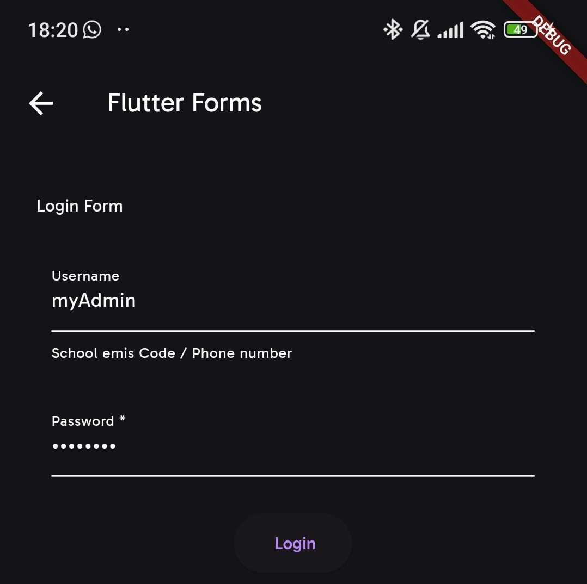
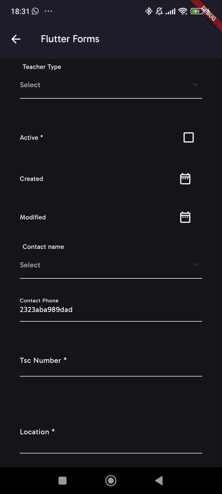

# Examples

## Login Form

### Dart Code

```dart title="auth/login/login.dart"
    MyCustomForm(
        formItems: loginOptions,
        enableOfflineMode: true,
        formTitle: "Login",
        storageContainer: "school",
        url: "o/token/",
        submitButtonPreText: "",
        submitButtonText: "Login",
        loadingMessage: "Signing in...",
        handleErrors: (value) {
        debugPrint("Error in $value");
        if (value != null) {
            return "Your password might be wrong".ctr;
        }
        return null;
        },
        instance: const {
        "username": "myadmin",
        "password": "#myadmin",
        "client_d": "NUiCuG59zwZJR14tIdWD7iQ5ILFnpxbdrO2epHIG",
        "grant_type": "password",
        },
        onSuccess: (res) async {
        debugPrint("Received");
        },
        onOfflineSuccess: (res) async {
        debugPrint("Success login.");
        debugPrint(res);
        await Future.delayed(const Duration(milliseconds: 1000));
        debugPrint("Done");
        },
        contentType: ContentType.form_url_encoded,
        extraFields: {
        "client_id": config.clientId,
        "grant_type": config.grantType,
        },
        formGroupOrder: const [
        ["username"],
        ["password"]
        ],
        name: "Signupdada",
    )
```

### Options

```dart title="auth/login/loginOptions.dart"
const loginOptions = {
  "name": "List Create Shops Api",
  "description": "",
  "renders": ["application/json", "text/html"],
  "parses": [
    "application/json",
    "application/x-www-form-urlencoded",
    "multipart/form-data"
  ],
  "actions": {
    "POST": {
      "username": {
        "type": "string",
        "required": false,
        "read_only": false,
        "label": "Username",
        "max_length": 45,
        "placeholder": "School emis Code / Phone number"
      },
      "password": {
        "type": "string",
        "required": true,
        "read_only": false,
        "label": "Password",
        "obscure": true,
        "max_length": 25
      }
    }
  }
};
```

### Final Output



<br>

## Add User Form

### Dart Code

```dart title="teachers/add_teacher.dart"
MyCustomForm(
        name: "Hello",
        formItems: teacherOptions,
        onFormItemTranform: (FormItemField field) {
            if (field.name == "contact_name") {
            field.label = "${field.label} Transformed";
            }
            return field;
        },
        url: "api/v1/teachers",
        enableOfflineMode: true,
        enableOfflineSave: true,
        onControllerSetup: (contr) => controller = contr,
        instance: false
            ? null
            : {
                "contact_email": "michameiu@gmail.com",
                "id": 34,
                "role": 1,
                "contact_phone": "2323aba989dad",
                "phone": const ["121", "12", "13", "14"],
                "multifield": {
                "phone": [
                    FormChoice(
                    display_name: "Ler 11  District 1",
                    value: "12",
                    ),
                    FormChoice(
                    display_name: "Ler 12 -District 1",
                    value: "121",
                    ),
                    FormChoice(
                    display_name: "Ler 13  District 1",
                    value: "13",
                    ),
                    FormChoice(
                    display_name: "Ler 14  District 1",
                    value: "14",
                    ),
                ],
                "role": [
                    FormChoice(
                    display_name: "District 11",
                    value: "1",
                    ),
                ],
                }
            },
        storageContainer: "school",
        PreSaveData: (formData) {
        debugPrint(formData);
        return formData;
        },
        contentType: ContentType.json,
        formHeader: const Text("Welcome home"),
        onSuccess: (value) {
        debugPrint(value);
        debugPrint(value["modified"].runtimeType);
        if (controller != null) {
            var controlName = "modified";
            controller?.form
                .control(controlName)
                .setErrors({"Faield..": ""});
            controller?.form.control(controlName).markAsTouched();
        }
        },
        formGroupOrder: const [
        ['role'],
        ["phone"],
        ["active"],
        ["created"],
        ["modified"],
        ["contact_name"],
        ["contact_phone"],
        ["tsc_no"],
        [
            "contact_email"
        ],
        ["location"]
        ],
        formTitle: "Login",
        formFooter: Padding(
        padding: const EdgeInsets.only(top: 20),
        child: Text("Sign Up"),
        ),
    ),
```

### Options

```dart title="teachers/teacherOptions.dart"
const teacherOptions = {
  "name": "List Create Teachers Dynamics Api",
  "description": "Group statistics by:\n`type` = id, sub-county, county",
  "renders": ["application/json", "text/html"],
  "parses": [
    "application/json",
    "application/x-www-form-urlencoded",
    "multipart/form-data"
  ],
  "actions": {
    "POST": {
      "name": {
        "type": "string",
        "required": false,
        "read_only": false,
        "label": "Name",
        "max_length": 45
      },
      "id": {
        "type": "integer",
        "required": false,
        "read_only": true,
        "label": "ID"
      },
      "school_name": {
        "type": "string",
        "required": false,
        "read_only": true,
        "label": "School name"
      },
      "username": {
        "type": "string",
        "required": false,
        "read_only": true,
        "label": "Username"
      },
      "tsc_no": {
        "type": "integer",
        "required": true,
        "read_only": false,
        "label": "Tsc Number",
        "max_length": 45,
        "show_only": "TSC",
        // "from_field": "role",
        "default": ""
      },
      "role_name": {
        "type": "string",
        "required": false,
        "read_only": true,
        "label": "Role name"
      },
      "created": {
        "type": "date",
        "required": false,
        "read_only": false,
        "label": "Created",
        "start_value": "1985-08-14",
        "end_value": "today"
      },
      "first_name": {
        "type": "string",
        "required": true,
        "read_only": false,
        "label": "First name",
        "max_length": 45
      },
      "contact_phone": {
        "type": "alphabets",
        "required": false,
        "read_only": false,
        "label": "Contact Phone",
      },
      "contact_name": {
        "type": "field",
        "required": false,
        "read_only": false,
        "label": "Contact name",
        "url": "api/v1/shops",
        "instance_url": "api/v1/shops/",
        "display_name": "name",
        "search_field": "name",
        "max_length": 45,
        "select_first": false,
        "placeholder": "The name of the customer to deliver to"
      },
      "contact_email": {
        "type": "multifield",
        "required": false,
        "read_only": false,
        "label": "Contact Email",
        "url": "api/v1/users",
        "display_name": "username",
        "search_field": "username",
        "max_length": 45,
        "value_field": "email",
        "placeholder": "Search by username ...",
        "show_only": "myadmin",
        "show_only_field": "name",
        "show_reset_value": false,
        "from_field": "contact_name"
      },
     // ----- concatenated for brevity
     //
    }
  }
};

```

### Final Output


