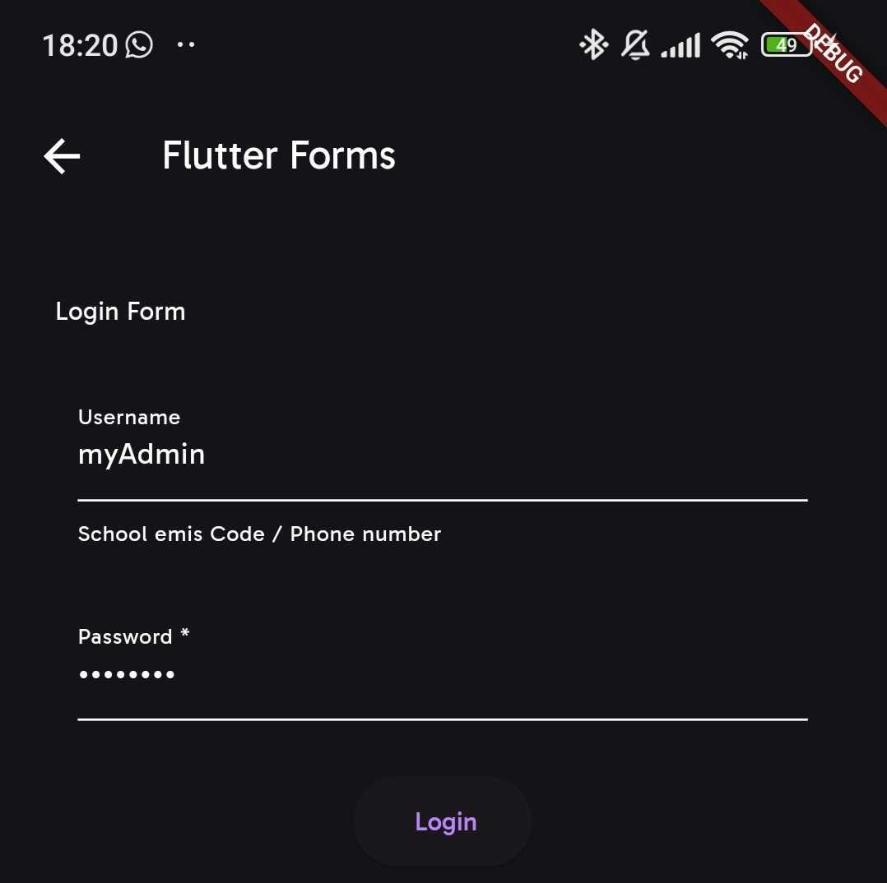
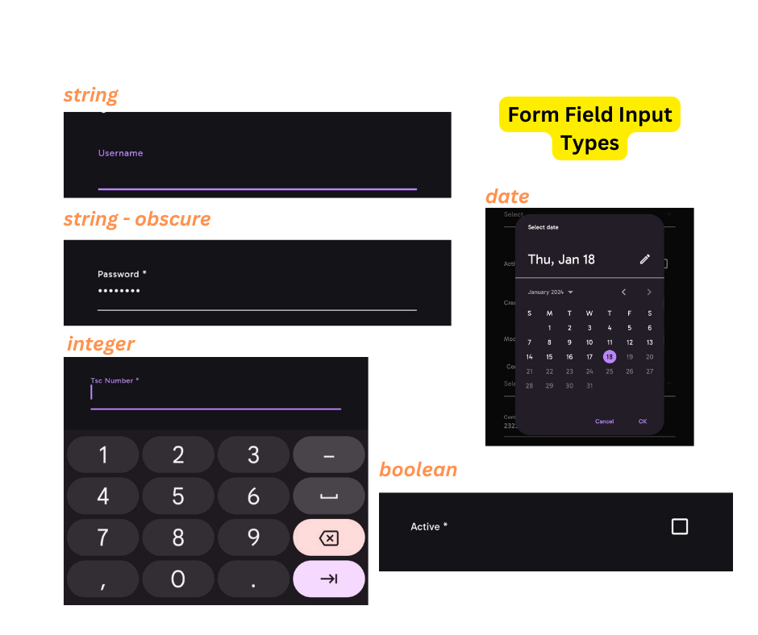

# Under The Hood

This section explains the inner workings of Sisitech Flutter Forms. In essence, a Sisitech flutter form is made up of three key components each utilizing different parameters you pass to MyCustomForm. These components are:

1. [Form Header](#form-header): A widget at the top of the form that shows the form title.
2. [Form Fields](#form-fields): A collection of TextFormFields that take up input (most are based off ReactiveTextField component from the [reactive_forms](https://pub.dev/packages/reactive_forms) package while the rest are custom made from Flutter's TextFormField widget).
3. [Form Submit Button](#form-submit-button): A widget that provides the onSubmit button functionality as well as errors arising from form validation and submission.



<br>

## Form Header

- This is the part of the form that let's the user know what the form is about. In most cases it simply contains the form title, but it can be further modified to even show instructions, form progress among other details.

> **Note:** <br>
>
> > Displaying the form header is based on the key parameter, `form_title`. If `form_title == null` then this part of the form is not displayed.

- The key parameters involved in this section are:

| Parameters     | Is Required | Description                                   | Example                         | Default Value |
| -------------- | ----------- | --------------------------------------------- | ------------------------------- | ------------- |
| formTitle      | X           | Title displayed at the top of the form.       | `"Login"`                       | -             |
| formTitleStyle | X           | Style for the form title.                     | `TextStyle(color: Colors.blue)` | -             |
| formHeader     | X           | Header widget to be displayed above the form. | `MyCustomFormHeader()`          | -             |

---

## Form Fields

- This section renders the various TextFormFields that make up the form.
- The key parameters involved in this section are:

| Parameters     | Is Required | Description                                                                                                                   | Example                                       | Default Value                                 |
| -------------- | ----------- | ----------------------------------------------------------------------------------------------------------------------------- | --------------------------------------------- | --------------------------------------------- |
| formGroupOrder | ✅          | List of input names that determine the order of the input fields to be displayed.                                             | `["email", "password"]`                       | -                                             |
| formItems      | X           | Default [formOptions](../flutterForms/UnderTheHood.md/#form-fields) used to determine the types of text form fields rendered. | [Appendix: Default Options](#default-options) | [Appendix: Default Options](#default-options) |

### Form Group Order

- `formGroupOrder`, of type `List<List<String>>`, is a **required** MyCustomForm parameter that takes a list of input field names encapsulated in lists. These lists should be in the order that the input fields are meant to appear on the form.

```dart title="formGroupOrder example"
const List<List<String>> formOrder = [
    ['role'],
    ["phone"],
    ["active"],
    ["created"],
    ["modified"],
]
```

### Form Items

- `formItems`, of type `Map<String, dynamic>`, is a MyCustomForm parameter that takes a map of form options with two important keys i.e `name` and `actions`.
- The ` actions``POST ` key is expected to contain a map of configurations for each of the input fields contained in `formGroupOrder`. These configurations are what determine the text field type, display details as well as validation rules for each specified input field.

```dart title="formItems example"
const loginOptions = {
  "name": "List Create Shops Api",
  "description": "",
  "renders": ["application/json", "text/html"],
  "parses": [
    "application/json",
    "application/x-www-form-urlencoded",
    "multipart/form-data"
  ],
  "actions": {
    "POST": {
      "username": {
        "type": "string",
        "required": false,
        "read_only": false,
        "label": "Username",
        "max_length": 45,
        "placeholder": "School emis Code / Phone number"
      },
      "password": {
        "type": "string",
        "required": true,
        "read_only": false,
        "label": "Password",
        "obscure": true,
        "max_length": 25
      }
    }
  }
};
```

- The `formItems` parameter is what MyCustomFrom uses to create a list of `FormFieldItem` objects used to render the different form fields. The functional attributes of this class as well as their details are outlined in the table below:

| Parameters    | Is Required | Description                                                           | Example                 |
| ------------- | ----------- | --------------------------------------------------------------------- | ----------------------- |
| name          | ✅          | The name of the form item field.                                      | `"username"`            |
| type          | ✅          | The type of the form item field.                                      | `FormItemType.text`     |
| label         | ✅          | The label for the form item field.                                    | `"Username"`            |
| obscure       | X           | Whether the form item field should be obscured (e.g., for passwords). | `true` or `false`       |
| placeholder   | X           | The placeholder text for the form item field.                         | `"Enter your username"` |
| required      | X           | Whether the form item field is required.                              | `true` or `false`       |
| read_only     | X           | Whether the form item field is read-only.                             | `true` or `false`       |
| max_length    | X           | The maximum length allowed for the form item field.                   | `10`                    |
| start_value   | X           | The starting value for date form field items.                         | `"John Doe"`            |
| end_value     | X           | The ending value for date form field items.                           | `"Jane Doe"`            |
| hasController | X           | Whether the form item field has an associated controller.             | `true` or `false`       |

> **Note:** <br>
>
> > This is not a comprehensive list of all the attributes of class `FormFieldItem` but rather a highlight of the ones fully implemented. More are to come ...

- As it can be observed from the tables, the attributes of this class mirror the configurations provided in `formItems` . Attributes such as `name, type, label, obscure` & `placeholder` determine the display aspects of the specified input field. One can render various types of form fields depending on the value of the `type` attribute. The table below outlines the different types of input fields possible with Flutter Forms and details about them:

| InputType           | Details                                                                                                                                      |
| ------------------- | -------------------------------------------------------------------------------------------------------------------------------------------- |
| `string`            | For character input. If total characters exceed **300**, the text field becomes a text area. Has special validation for character only input |
| `integer`           | For digit input. Has special validation for digit only input                                                                                 |
| `date`              | Shows Flutter's DatePicker for date input. Works with the `start_value` & `end_value` to determine start and end dates respectively          |
| `multifield`        | Displays multiple Flutter ChoiceChips input field                                                                                            |
| `boolean`           | Displays a checkbox input field                                                                                                              |
| `choice` or `field` | Displays a drop down input field                                                                                                             |
| `email`             | For email input. Has special validation for email only input                                                                                 |



<br>

> **Note:** <br>
>
> > It is important to note that much as this field is not required, it comes in handy almost 99% of the time when defining the nitty gritties of your form's input fields. That said, if the parameter is not provided, then [Default Options](#default-options) is used.

---

## Form Submit Button

- To put it simply, this is where all the important stuff happens. This section displays the button, as well as the validation or submission errors from the form.


<br>

- We start with the parameters that the button itself uses and then delve into what happens `onSubmit()`.

1. **name:**

   > This parameter is used to id the current flutter form. It is what is used by `Get.find()` on submit to retrieve the instance of the form.

   > It is required (✅).

2. **submitButtonPreText:**

   > As the name suggests, it is the text that is shown before the `submitButtonText`.

   > It is not required (X) and is often passed as a blank string.

   > If nothing is passed, i.e it is null, then the button shows the text associated with the current `FormStatus`.

   > `FormStatus` is basically an enum relating to various CRUD operations and the related HTTP method. The default is `FormStatus.Add` which relates to the `POST` HTTP method. The form status becomes `FormStatus.Update` if the instance passed to `MyCustomForm` has an `id`.

   > Consequently, when form status is Add then the `submitButtonPreText = 'Add'`, if Update then `submitButtonPreText = 'Update'`

3. **submitButtonText:**

   > As the name suggests, it is the text that is shown as the button text in concatenation (comes after) with `submitButtonPreText`.

4. **loadingMessage:**

   > Shows in place of the derived button text above when the form's internal isLoading attribute is set to `true`.

   > It is not required (X).

5. **enableOfflineMode:**

   > If there is no internet and `enableOfflineMode` is set to `false`, then the a text showing `No Internet Connection` is shown in place of the button.

   > But if either isConnectedToInternet or enableOfflineMode are set to true, then the button shows.

   > It is not required (X) and the default value is `false`.

---

- Now we take a look at what happens when the button is pressed and onSubmit is triggered. The diagram below shows the process flow and the related function and boolean parameters used during onSubmit.


<br>

---

---

### Appendix

#### Default Options

```dart
const Map<String, dynamic> defaultOptions = {
  "name": "",
  "actions": actions,
};
```

#### Example Instance

```dart
const Map<String, dynamic>  instance = {
        "id": 12,
        "username": "myadmin",
        "password": "#myadmin",
        "client_d": "NUiCuG59zwZJR14tIdWD7iQ5ILFnpxbdrO2epHIG",
        "grant_type": "password",
        },
```
