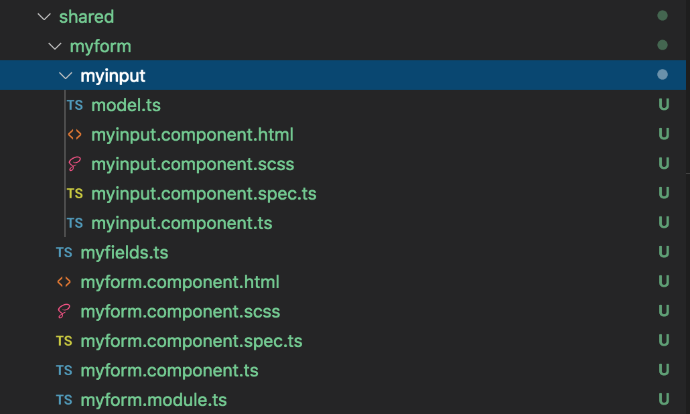
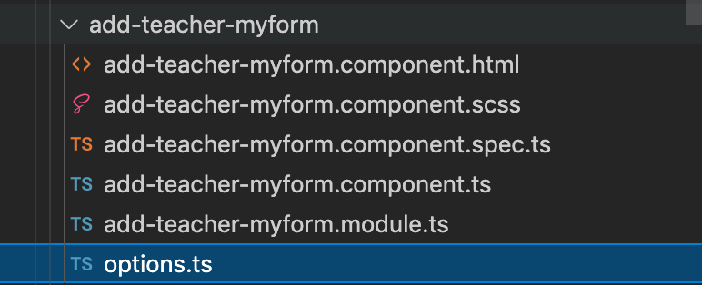
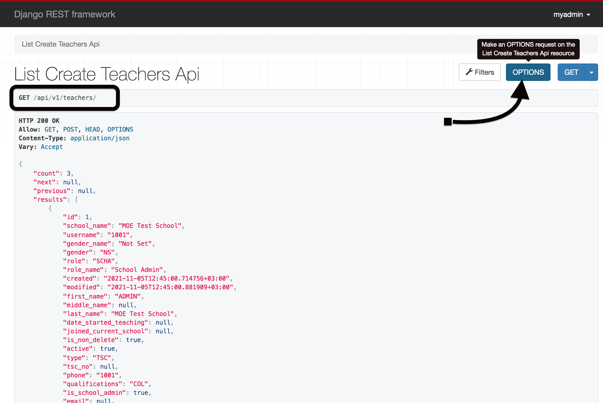
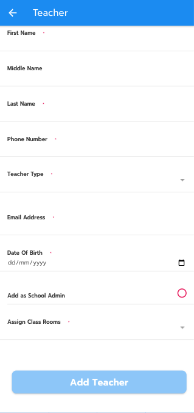

## Sisitech Forms
___

Sisitech Forms is a forms library that provide functionality that allows users to interact with the web page. This way a user can submit data to a server for processing. Our form architecture sits in between the front-end (user-facing) side and the backend while handling front-end and server side validation as well as HTTP requests.  

### Angular Forms 

--- 

### Installation

- Copy the myform package into your project's **shared** folder. 




### Configuration

- Replace the variable API_URL in the myform.component.ts page with your API's URL provided.

``` ts title="myform.component.ts"

const API_URL = "https://pl-emis.com"

```


<br>

- Inside your myform.module.ts, provide your AuthInterceptor class.

``` ts hl_lines="30 31 32" title="myform.module.ts" linenums="1"

import { CUSTOM_ELEMENTS_SCHEMA, NgModule } from '@angular/core';
import { CommonModule } from '@angular/common';
import { MyformComponent } from './myform.component';
import { MyinputComponent } from './myinput/myinput.component';
import { HttpClientModule, HTTP_INTERCEPTORS } from '@angular/common/http';
import { ReactiveFormsModule } from '@angular/forms';
//import { ModalsModule } from '../modals/modals.module';
import { IonicModule } from '@ionic/angular';
import { AuthInterceptor } from 'src/app/authInterceptor/auth.interceptor';

@NgModule({
  declarations: [
    MyformComponent,
    MyinputComponent,
  ],
  imports: [
    IonicModule,
    CommonModule,
    ReactiveFormsModule,
    //  ModalsModule,
    HttpClientModule,
  ],
  schemas: [
    CUSTOM_ELEMENTS_SCHEMA
  ],
  exports: [
    MyformComponent,
    MyinputComponent,
  ],
  providers: [
    { provide: HTTP_INTERCEPTORS, useClass: AuthInterceptor, multi: true }
  ]
})
export class MyformModule { }
```

<br>

### Usage

#### Front End Integration

- Create a module and a component using the angular cli command to create your form page that will start using Sisitech Angular forms.

```
 ng g m add-teacher-myform
 ng g c add-teacher-myform

```

- Import the FormsModule and MyformModule, set up your routes and add the component to the declarations. 

``` ts hl_lines="3 8 9 13 19 22 23 25" title="add-teacher-myform/add-teacher-myform.module.ts" linenums="1"
import { NgModule } from '@angular/core';
import { CommonModule } from '@angular/common';
import { AddTeacherMyformComponent } from './add-teacher-myform.component'
import { from } from 'rxjs';
import { TranslateModule } from '@ngx-translate/core';
import { RouterModule, Routes } from '@angular/router';
import { IonicModule } from '@ionic/angular';
import { FormsModule } from '@angular/forms';
import { MyformModule } from '../shared/myform/myform.module';
const routes: Routes = [
  {
    path: '',
    component: AddTeacherMyformComponent
  }
];

@NgModule({

  declarations: [AddTeacherMyformComponent],
  imports: [
    CommonModule,
    FormsModule,
    MyformModule,
    IonicModule,
    RouterModule.forChild(routes),
    TranslateModule
  ]
})
export class AddTeacherMyformModule { }
```

- Create an options.ts file 



#### Server Side Integration


Go to your specific API endpoint and click on the options button to get the options file. 



Define and export an options object in your options file

``` ts title="add-teacher-myform/options.ts"
const options = {

}

export {
    options
}


```
Copy the contents of the response options into your created **options.ts** file

``` ts title="add-teacher-myform/options.ts"
const options = {
    "name": "List Create Teachers Api",
    "description": "",
    "renders": [
        "application/json",
        "text/html"
    ],
    "parses": [
        "application/json",
        "application/x-www-form-urlencoded",
        "multipart/form-data"
    ],
    "actions": {
        "POST": {
            "id": {
                "type": "integer",
                "required": false,
                "read_only": true,
                "label": "ID"
            },
            "school_name": {
                "type": "string",
                "required": false,
                "read_only": true,
                "label": "School name"
            },
            "username": {
                "type": "string",
                "required": false,
                "read_only": true,
                "label": "Username"
            }
        }
    }
}

export {
    options
}

```

#### Displaying the Form

Add `<app-myform></app-myform>` tag to the **html** file

Refer to the table below for the various basic input and output options. 

| Option | Is Required | Descripiton | Example |
|:------ | :------: |:------ |:------|
| formItems | ✅ | `@Input` This is used to pass the exported form options from `options.ts`| |
| formGroupOrder | ✅ | `@Input` An array within an array used to define the fields to be included and their order | |
| url | ✖️ | `@Input` URL path of the API endpoint | `/api/v1/teachers` |
| extraFields | ✖️ | `@Input` Any constant fields that are not included in the form and may be required by the API an example would be an access token | `{"token":"Ahw7HD7a"}` |
| submitButtonText | ✖️ | `@Input` The text displayed in the form submit button. The default value is `Post` | `Teacher` , `Learner`, `Class` |
| instance | ✖️ | `@Input` - an object provided during update of any previously created instances to trigger edit mode |  |
| submitButtonPreText | ✖️ | The text displayed in the form submit button before the submit button text (`submitButtonText`). By default the value is `Add`, and if an `instance` is included the value is `Update` | `Add`, `Edit`, `Update`|
| isValidationOnly | ✖️ | `@Input` - used to validate a form without posting to any URL e.g. in a multi-step form | `true` or `false`|
| onValidatedData | ✖️ | `@Output` - an event triggered on successful validation with the value of the valid form only if `isValidationOnly` is `true`  | |
| onPostedData | ✖️ | `@Output` - an event triggered with the value of the HTTP response from the API with successful status codes (`200`, `201`, `204`) | |
| preSaveDataFunction | ✖️ | `@Input` - a function that accepts and return a JSON used to manipulate the form data after successful validation before `onValidatedData` and `onPostedData`  |  |
| isLoading$ | ✖️ | `@Output` - an event triggered with the value `true` when a HTTP request is started and `false` on completion |  |
| httpMethod | ✖️ | `@Input` - used to override the HTTP request method. Only `post`, `put` and `patch` are supported | `POST`, `PUT`, `PATCH`  |
| httpMethod | ✖️ | `@Input` - used to override the HTTP request method. Only `post`, `put` and `patch` are supported | `POST`, `PUT`, `PATCH`  |

#### Defining a Form Group Order

An array within an array used to define the fields to be included and the order to be displayed. 

``` ts
  formGroupOrder = [
    ['first_name'],
    ['middle_name'],
    ['last_name'],
    ['phone'],
  ]

```
Note: Make sure your array within an arrat **formGroupOrder** is seperated with commas. 

The options `first_name`, `middle_name` etc are the keys names for the `POST` object in the `options.ts`

``` ts hl_lines="21 27 33 39" linenums="1" title="add-teacher-myform/options.ts"

const options = {
    "name": "List Create Teachers Api",
    "description": "",
    "renders": [
        "application/json",
        "text/html"
    ],
    "parses": [
        "application/json",
        "application/x-www-form-urlencoded",
        "multipart/form-data"
    ],
    "actions": {
        "POST": {
            "id": {
                "type": "integer",
                "required": false,
                "read_only": true,
                "label": "ID"
            },
            "first_name": {
                "type": "string",
                "required": false,
                "read_only": false,
                "label": "First Name"
            },
            "middle_name": {
                "type": "string",
                "required": false,
                "read_only": false,
                "label": "Middle Name"
            },
            "last_name": {
                "type": "string",
                "required": true,
                "read_only": false,
                "label": "Last Name"
            },  
            "phone": {
                "type": "string",
                "required": false,
                "read_only": false,
                "label": "Phone Number"
            }
        }
    }
}

export {
    options
}

```
___

#### Usage Example

**HTML** 

``` ts title="add-teacher-myform/add-teacher-myform.component.html"
  <app-myform [extraFields]="extra_fields" [formItems]="formItems" [url]="url"
    (onValidatedData)="onValidatedData($event)" [submitButtonText]="'Teacher'" [formGroupOrder]="formGroupOrder"
    [hideButtons]=false (onPostedData)="onPostedData($event)" [instance]="instance">
  </app-myform>
```

**TS**

``` ts title="add-teacher-myform/add-teacher-myform.component.ts"
import { Component, OnInit } from '@angular/core';
import { options } from './options';
import { ActivatedRoute, Router } from '@angular/router';
import { NavController } from '@ionic/angular';
import { CommonService } from '../services/common-services/common.service';
import { Events } from '../services/common-services/events';

@Component({
  selector: 'app-add-teacher-myform',
  templateUrl: './add-teacher-myform.component.html',
  styleUrls: ['./add-teacher-myform.component.scss'],
})
export class AddTeacherMyformComponent implements OnInit {
  formItems: any = options;
  url: string = "api/v1/teachers/"
  extra_fields: any
  originalInstance: any
  formGroupOrder = [
    ['first_name'],
    ['middle_name'],
    ['last_name'],
    ['phone'],
    ['type'],
    ['tsc_no'],
    ['email'],
    ['dob'],
    ['is_school_admin'],
    ['streams']
  ]
  instance: any;
  constructor(private route: ActivatedRoute, private router: Router,
    public navCtr: NavController, public events: Events,
    public commonService: CommonService,
  ) {
    this.route.queryParams.subscribe(params => {
      if (this.router.getCurrentNavigation().extras.state) {
        const instance = this.router.getCurrentNavigation().extras.state.instance;
        this.originalInstance = instance
        this.instance = { ...instance }
      }
    });
  }


  preSendData(data) {
    data["HsPresave"] = true
    return data
  }

  ngOnInit() {
    this.getProfile()
  }
  getProfile() {
    return this.commonService.storageUserProfile().then(data => {
      this.extra_fields = {
        school: data.id
      }
    });
  }


  onValidatedData(data: any) {
    console.log(data)
  }

  async onPostedData(data) {
      // Do something
  }

}

```


### Testing Your Form

Test your forms to confirm it's working well. 

