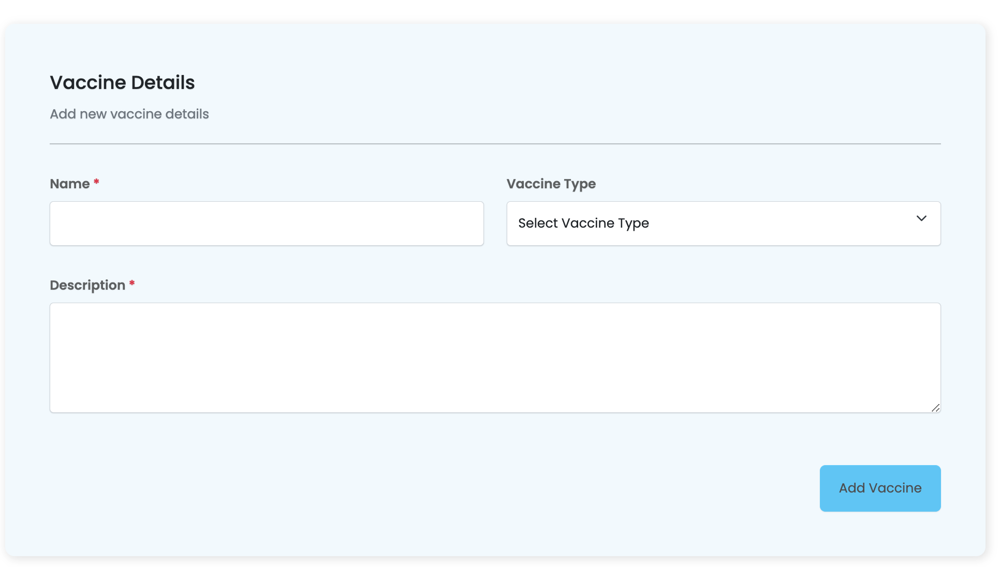
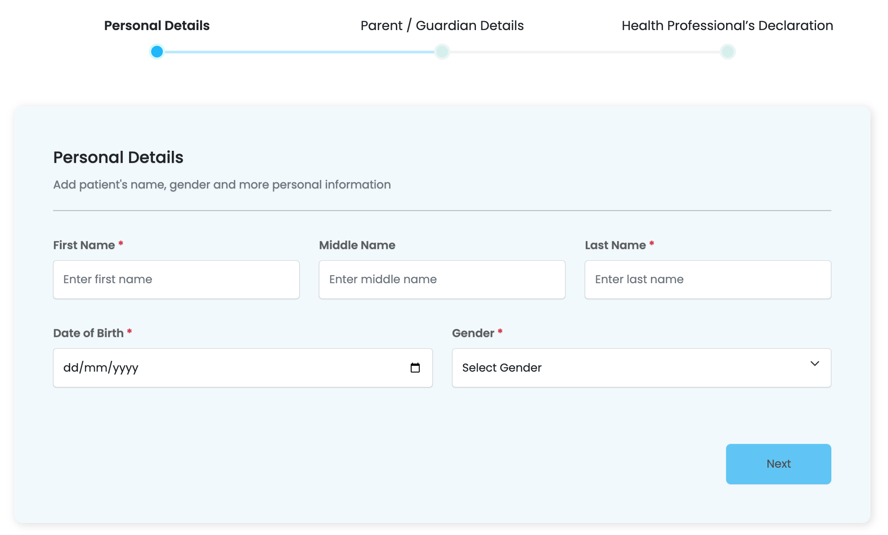

# Example Setups 

## Single Form

### HTML Setup Example
- An example for how to set up a **single form** in html:

``` html title="vaccines/add/add.component.html"
  <app-myform instanceName="Vaccine @name#" name="vac" [enableAddAnother]="true" [extraFields]="extra_fields"
      [formItems]="formItems" [url]="url" (onValidatedData)="onValidatedData($event)" [submitButtonText]="'Vaccine'"
      [formGroupOrder]="formGroupOrder" [hideButtons]=false [instance]="instance"
      (onPostedData)="onVaccineCreated($event)">
    </app-myform>
```

### TS Setup Example
- An example for how to set up a **single form** in typescript:

``` ts title="vaccines/add/add.component.ts"
import { Component, OnInit } from '@angular/core';
import { MyFormSection } from '@sisitech/myform';
import { FormControl, FormGroup } from '@angular/forms';
import { filterOptions } from '../options';
import { ActivatedRoute, Router } from '@angular/router';
import { Subscription } from 'rxjs/internal/Subscription';

@Component({
  selector: 'app-add',
  templateUrl: './add.component.html',
  styleUrls: ['./add.component.scss']
})
export class AddComponent implements OnInit {

  title = "Add New Vaccine"
  subtitle = "Add new vaccine details in the form below"
  buttonText = "New Vaccine"
  buttonLink = "/vaccines/add"
  instance: any
  routeParamSub?: Subscription;
  routeSub?: Subscription;
  actionName: string = "Add"

  constructor(private route: ActivatedRoute, private router: Router) {
    this.routeParamSub = this.route.queryParams.subscribe(params => {
      if (this.router.getCurrentNavigation()?.extras.state) {
        const instance = this.router.getCurrentNavigation()?.extras.state;
        if (instance?.hasOwnProperty("id")) {
          // this.setIntance(instance)
          this.providedInstance = instance
        }
      }
    })

    this.routeSub = this.route.params.subscribe(params => {
      console.log(params);
      this.id = params['id'];

      if (this.id) {
        this.actionName = "Update"

        this.title = this.actionName + " Vaccine Details"
        this.subtitle = this.actionName + " vaccine details in the form below"
        this.section1.subTitle = this.actionName + " vaccine details"
      }
    });
  }

  ngOnDestroy(): void {
    this.routeParamSub?.unsubscribe()
    this.routeSub?.unsubscribe()
  }

  ngOnInit(): void {
    this.formGroup.valueChanges.subscribe(res => {
      console.log(res)
    })
  }


  collapseFilters = false
  formItems: any = filterOptions;
  validateOnly = true
  url: string = "api/v1/vaccines/"
  extra_fields: any
  originalInstance: any
  providedInstance: any
  id: any = ""

  section1: MyFormSection = {
    title: "Vaccine  Details",
    subTitle: " vaccine details",
    formGroupOrder: [
      [
        'name',
        'organization'],
      ['description']
    ]
  }


  formGroupOrder = [
    this.section1
  ]

  formGroup = new FormGroup({
    search: new FormControl("")
  })

  setIntance(new_instance: any) {
    console.log("Setting instance");
    this.instance = new_instance

    console.log(this.instance)
    // this.id = new_instance.id
  }

  onVaccineCreated(patient: any) {
    console.log(patient)
    window.history.back();
  }

  formChanges(form: any) {
    console.log(form)
  }

  onValidatedData(data: any) {
    console.log(data)
  }

}
```

### Final Output
- The final form will be served as follows:



## Multi-Form

### HTML Setup Example
- An example for how to set up a **multi-step form** in html:

``` html title="vaccines/add/add.component.html"
<sistch-multistep-form [instance]="instance" (onPostedData)="onPatientCreated($event)" [options]="multistepForm">
</sistch-multistep-form>
```

### TS Setup Example
- An example for how to set up a **multi form** in typescript:

```ts
import { Component, OnDestroy, OnInit } from '@angular/core';
import { filterOptions } from './enroll_options';
import { options } from './options';
import { FormControl, FormGroup } from '@angular/forms';
import { MutliStepForm, MyFormSection } from '@sisitech/myform';
import { ActivatedRoute, Router } from '@angular/router';
import { Subscription } from 'rxjs/internal/Subscription';
import { PreviousRouteService } from '@sisitech/utils';

@Component({
  selector: 'app-add-patient',
  templateUrl: './add-patient.component.html',
  styleUrls: ['./add-patient.component.scss']
})
export class AddPatientComponent implements OnInit, OnDestroy {

  title = "New Patient"
  subtitle = "New patient details in the form below"
  buttonText = "New Patient"
  buttonLink = "/patients/add"
  instance: any
  routeParamSub?: Subscription;
  routeSub?: Subscription;
  actionName: string = "Add"

  constructor(private route: ActivatedRoute, private router: Router,
    private previousService: PreviousRouteService,
  ) {
    this.routeParamSub = this.route.queryParams.subscribe(params => {
      if (this.router.getCurrentNavigation()?.extras.state) {
        const instance = this.router.getCurrentNavigation()?.extras.state;
        if (instance?.hasOwnProperty("id")) {
          // this.setIntance(instance)
          this.providedInstance = instance
        }
      }
    })

    this.routeSub = this.route.params.subscribe(params => {
      console.log(params);
      this.id = params['id'];

      if (this.id) {
        this.actionName = "Update"
        this.section1.subTitle = this.actionName + " patient's name, gender and more personal information"
        this.section2.subTitle = this.actionName + " parent or guardian details"

        this.title = this.actionName + " Patient"
        this.subtitle = this.actionName + " patient details in the form below"
      }
    });
  }

  ngOnDestroy(): void {
    this.routeParamSub?.unsubscribe()
    this.routeSub?.unsubscribe()
  }

  ngOnInit(): void {
    console.log(this.previousService.getPreviousUrl())
    console.log(this.previousService.getCurrentsUrl())
    this.formGroup.valueChanges.subscribe(res => {
      console.log(res)
    })
  }

  filterOptions: any = filterOptions
  collapseFilters = false
  filterGroupOrder = [
    ['grouping', 'paginator'],
    ['region', 'district', 'gender'],
    ['school', 'base_class', 'status']
  ]

  formItems: any = options;
  validateOnly = true
  url: string = "api/v1/patients/"
  extra_fields: any
  originalInstance: any
  id: any = ""
  providedInstance: any
  formGroupOrder = [
    ['first_name', 'middle_name', 'last_name'],
    ['phone', 'streams'],
    ['sms']
  ]

  section1: MyFormSection = {
    title: "Personal Details",
    subTitle: this.actionName + " patient's name, gender and more personal information",
    formGroupOrder: [
      ['first_name', 'middle_name', 'last_name'],
      ['dob', 'gender'],
    ]
  }
  section2: MyFormSection = {
    title: "Parent / Guardian  Details",
    subTitle: this.actionName + " parent or guardian details",
    formGroupOrder: [
      ['guardian_name', 'guardian_email', 'guardian_phone'],
      ['sub_county', 'guardian_relationship']
    ]
  }
  section3: MyFormSection = {
    title: "Health Professional’s Declaration",
    subTitle: "I certify that the information I have provided in this form is true and correct. I have obtained proof of the vaccination(s) given.",
    formGroupOrder: [
      ['medical_license_number'],
      ['i_have_read']
    ]
  }

  sectionFormGroup: MyFormSection[] = [
    this.section1, this.section2
  ]

  multistepForm: MutliStepForm = {
    url: "api/v1/patients/",
    options: options,
    submitButtonText: "Patient",
    forms: [
      {
        stepTitle: "Personal Details",
        sections: [this.section1]
      },
      {
        stepTitle: "Parent / Guardian  Details",
        sections: [this.section2]
      },
      {
        stepTitle: "Health Professional’s Declaration",
        sections: [this.section3]
      },
    ]
  }

  formGroup = new FormGroup({
    search: new FormControl("")
  })

  setIntance(new_instance: any) {
    console.log("Setting instance");
    // new_instance.sub_county = [2, 1]
    this.instance = new_instance

    console.log(this.instance)
    // this.id = new_instance.id
  }

  onValidatedData(data: any) {
    console.log(data)
  }
  onPatientCreated(patient: any) {
    console.log(patient)
    if (patient && patient.alert_notification) {
      patient.alert_notification.message = "Patient Id: @id - @full_name @action#"
    }
    // window.history.back();
    // console.log(this.previousService.getPreviousUrl())

    this.router.navigate([this.previousService.getPreviousUrl()], { state: patient })
  }

  formChanges(form: any) {
    console.log(form)
  }

}

```

### Final Output
- The final form will be served as follows:



**Useful Links**
<br>

- [Overview](../myForms/overview.md): Introduction to myForms.
- [Getting Started](../myForms/gettingStarted.md): Learn how to install and set up Sisitech Forms in your project.
- [Usage](../myForms/usage.md): Discover how to create, customize, and work with forms using our library.
- [Under the Hood](../myForms/underTheHood.md): Dive into the details of the library's functions, classes, and components.
- [Examples](../myForms/examples.md): See real-world examples of Sisitech Forms in action.
- [FAQs](../myForms/faqs.md): Find answers to common questions and troubleshooting tips.