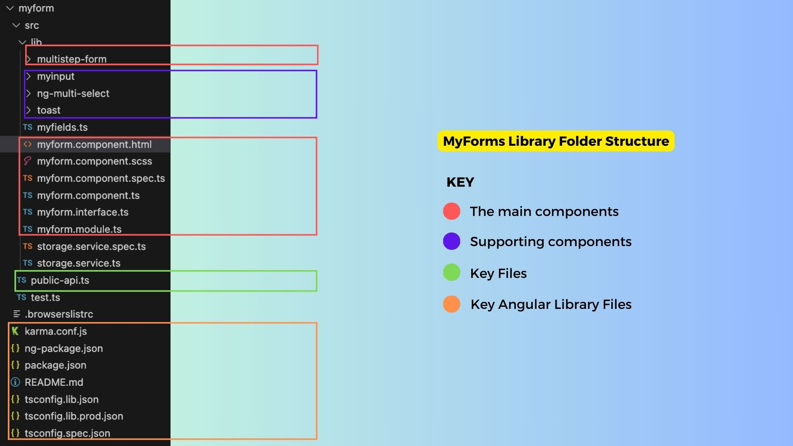
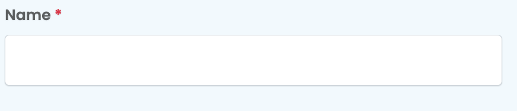
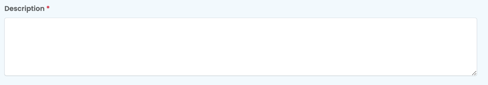
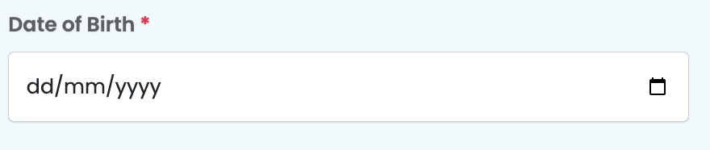
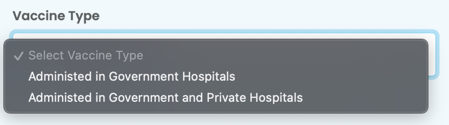

# Under The Hood

## Introduction
- Reactive forms provide a model-driven approach to handling form inputs whose values change over time using concepts such as FormControl.
- Sisitech MyForms can be looked at as extension of Angular's [Reactive Forms](https://angular.io/guide/reactive-forms) component coupled with several [Angular Ng Directives](https://angular.io/guide/built-in-directives) to achieve the dynamic module we know and use today.
- The easiest way to understand the inner workings of MyForms is to look at the html component of two key folders within the module i.e myform.component.html and multistep-form.component.html.
- But first, let's dive into the folder structure of the MyForms module to know where different folders and files are located and also to understand teh importance of some of them.

## Folder Structure
- The image below shows the folder structure of the MyForms library and a brief explanation of what each folder/file is about:
  <br>
 
  <br>

- The table below gives a more detailed breakdown of the key files in the structure above:
  <br>

 | Folder/File           | Description                                                                                              |
|-----------------------|----------------------------------------------------------------------------------------------------------|
| 🗒️ Myforms.component.html | The main myforms component files. The .html file contains the HTML code that renders the form on the frontend. |
| 🗒️ Myforms.component.ts   | The .ts file contains the key functions and inputs that handle the data being passed through Myforms.    |
| 🗒️ Myforms.component.scss |                                                                                                        |
| 🗒️ Myforms.interface.ts  | The interface.ts file contains the key classes representing data objects used in Myforms.             |
| 🗒️ Myforms.module.ts    | The module.ts file contains the modules Myforms is dependent on.                                       |
| 📁 multistep-form       | The folder that houses the multistep form component of the MyForms library.                             |
| 📁 myinput              | The component is used to render different kinds of form fields on Myforms.                                |
| 📁 ng-multi-select      | This is used as a sub-component of the myinput component used to render a specific type of form field that has multiple options to select from. Think of it as a drop-down component. |
| 📁 toast                | A supporting component that renders a toast message at the top or bottom of a form. It’s used to provide feedback when different form actions are triggered. The storage service.ts files support this component. |
| 🗒️ public.api.ts         | The file that exposes the different components within the MyForms library. Only the files listed here can be referenced by consumers of the library. |
| 🗒️ ng.package.json       | The files that control the naming and versioning details of the MyForms library.                           |
 
  <br>

## Key Files & Components
- Now that we know the different files that make up the MyForms Library, it's time to delve into the core components of this library. 
- As mentioned earlier, the best place to start is the two html files for myforms and the multistep-form.

### myform.component.html
- The MyForms html file shows the different key components and inputs that make up the myforms module. 
- The code below shows the basic <form></form> html element that is enriched with multiple components and rendered differently using boolean values we pass to the *ngIf directives controlling differnet parts of the form.
- Follow this link to have an indepth look of the file: [myform.component.html](https://github.com/sisitech/myform/blob/main/projects/myform/src/lib/myform.component.html).

### Key Inputs & Outputs

- The inputs passed to app-myform are described in some detail in the table we discussed earlier in the [Inputs & Outputs](./usage.md/#myform-inputs--outputs) section of the [Usage](./usage.md) file.
- The table below shows another summary of the inputs and outputs the component.ts file features:

**Inputs**

<br>

| Input                     | Description                                                                             |
|---------------------------|-----------------------------------------------------------------------------------------|
| `formGroup`               | The Angular FormGroup for the form.                                                    |
| `submitButtonText`        | The text displayed on the submit button. Default is "Post."                            |
| `submitButtonPreText`     | Text to display before the submit button text.                                         |
| `formItems`               | Input data for the form.                                                                 |
| `name`                    | Name of the form.                                                                       |
| `instanceName`            | Name of the instance.                                                                  |
| `formActionName`          | Name of the form action.                                                               |
| `enableAddAnother`        | Indicates whether to enable adding another form. Default is `false`.                   |
| `enableAlertNotifications` | Indicates whether to enable alert notifications. Default is `true`.                   |
| `doUpdate`                | Indicates whether to perform an update. Default is `false`.                            |
| `extraFields`            | Extra fields for the form.                                                             |
| `httpMethod`             | HTTP method for form data submission.                                                  |
| `componentType`          | Type of component ("form" or "filter"). Default is "form."                               |
| `alerts`                 | Array of alert objects.                                                                |
| `collapseFilters`        | Set to `true` to collapse filters.                                                     |
| `instance`               | Input instance data.                                                                   |
| `url`                    | URL for data submission.                                                               |
| `readOnly`               | Indicates if the form is read-only.                                                     |
| `hideButtons`            | Indicates whether to hide buttons. Default is `false`.                                  |
| `formGroupOrder`         | Order of form group elements.                                                           |

<br>

**Outputs**
<br>

| Output               | Description                                      |
|----------------------|--------------------------------------------------|
| `onValidatedData`    | Emits validated form data.                      |
| `onPostedData`       | Emits data when it's posted.                    |
| `isLoading$`        | Emits loading status.                            |
| `onFormChanges`      | Emits form changes.                              |
| `instance`           | Output instance data.                           |

<br>

!!! note
    Please note that not all Inputs and Outputs have been documented, but this table covers the most important ones.

### Key Functions
- The table below, provides a breakdown of the key functions within the myforms component that handle the rendering of the form as well as well as data handling of the form.
- It shows the functions in the component, arguments they accept, their purpose and their return values if any.

<br>

| Function                 | Arguments                                 | Description                                                                                           | Output                   |
|--------------------------|------------------------------------------|-------------------------------------------------------------------------------------------------------|--------------------------|
| `ngAfterViewInit`        | None                                     | Lifecycle hook called after the view is initialized. Checks the collapse status of the filter div. | None                     |
| `getPossibleControls`    | None                                     | Retrieves possible form controls and sections from `formGroupOrder`.                                    | Returns an object with possible fields and sections. |
| `createControls`         | None                                     | Creates form controls based on `formGroupOrder` and `formItems`.                                      | None                     |
| `ngOnInit`               | None                                     | Lifecycle hook called when the component is initialized. Subscribes to form value changes.         | None                     |
| `ngOnDestroy`           | None                                     | Lifecycle hook called when the component is destroyed. Unsubscribes from form value changes.      | None                     |
| `filterCollapsableDivElement` | None                                | Retrieves the filter collapsable element.                                                            | Returns a filter collapsable element or `undefined`. |
| `setCollapseFilterStatus` | `status: boolean`                       | Sets the collapse status of the filter div.                                                        | None                     |
| `toggleFilterDivCollapse` | None                                     | Toggles the collapse status of the filter div.                                                       | None                     |
| `collpse`               | None                                     | Toggles the collapse status of the filter div.                                                       | None                     |
| `updateFormStuff`        | `val: any`                               | Updates form data.                                                                                    | None                     |
| `ngOnChanges`            | None                                     | Lifecycle hook called when input properties change. Checks instance changes.                        | None                     |
| `checkInstanceChangesUpdateForm` | None                             | Checks if the instance has changed and updates the form accordingly.                                  | None                     |
| `getDescriptionObject`   | `formControlName: string`                | Retrieves the description object for a form control.                                                  | Returns a description object. |
| `getFieldNameErros`     | `formControlName: string`                | Retrieves form errors for a specific field.                                                          | Returns form errors.      |
| `onKeydown`              | `event: any`                             | Handles keydown events.                                                                               | None                     |
| `resetForm`              | None                                     | Resets the form to its initial state.                                                                 | None                     |
| `showLoader`            | `status: boolean`                       | Displays or hides a loading spinner.                                                                  | None                     |
| `dataReceived`          | None                                     | Handles form data when it's received.                                                                | None                     |
| `filtersExpanded`       | `event: any`                             | Expands the filters.                                                                                  | None                     |
| `myFormValid`           | None                                     | Checks if the form is valid.                                                                         | Returns `true` or `false`. |
| `formAction`            | None                                     | Determines the form action name based on input properties.                                            | Returns the form action name. |
| `onDone`                | `event: any`                             | Emits posted data.                                                                                   | None                     |
| `removeNullFields`      | `data: any`                              | Removes null fields from data.                                                                       | Returns data with null fields removed. |
| `sendDataHttp`          | `data: any`                              | Sends form data via HTTP requests.                                                                   | None                     |
| `showSnackBar`          | `message: string`                        | Displays a snackbar message.                                                                         | None                     |
| `getControl`            | `name: string`                           | Retrieves a form control by name.                                                                    | Returns a form control or a new FormControl. |

<br>

### MyInput Component
- The provided component is designed to render various types of form fields based on the specified `formControlType`. 
- It can be used in both form-only and filter-only contexts, allowing for the creation of user interfaces for data entry and filtering in Angular applications. 
- This versatile component can handle a wide range of form field types, including dropdown selects, multiple selects, checkboxes, image displays, text areas, custom multi-select fields, file inputs, and text inputs. Each form field type is customized to display and interact with the user's data in a specific way. 
- This component serves as a flexible building block for creating forms and filters in Angular applications, enhancing user interactions and data management.
- The table below shows the different form field types that can be rendered based on the `formControlType` passed. The descriptions provide an overview of their functionality, and any special notes indicate specific behavior or characteristics to be aware of.

<br>

| Form Field Type      | Description                                | Special Notes                              |
|----------------------|--------------------------------------------|-------------------------------------------|
| `choice`             | Dropdown select field.                     | Options are fetched from `choices`.      |
| `multiplechoice`     | Multiple select field.                    | Options are fetched from `choices`.      |
| `boolean`            | Checkbox field.                            | Can have a label with optional text.      |
| `image_display`      | Display an image.                          | Includes a link to view/download the image. |
| `textArea`           | Multiline text input.                      | May include a placeholder text.           |
| `multifield`         | Multi-select field (custom component).    | Behavior determined by the `app-multi-select` component. |
| `file`               | File input field.                          | Can replace or display existing file.     |
| Default              | Text input field.                          | May include a placeholder text.           |

<br>

- The images below show the differnet kind of fields that can be rendered by the MyInput component:
  
**Basic Form Field**
<br>

<br>

**Text Area Field**
<br>

<br>

**Date Field**
<br>

<br>

**Multi-Select Field**
<br>

<br>

### multistep-form.component.html
- From the code below it is clear that the multistep form is a simple extension of the myforms component that has an iterative aspect to it introduced by the *ngFor directive used to loop through the multiple formGroups we pass to this component.

```html
<h3 class="card-title">{{options.title}}</h3>

<div class="row justify-content-md-center upe-mutistep-form">
    <div class="step-header d-flex mb-2">
        <span [ngStyle]="stepStyle(ind)" (click)="currentStep<ind?doNothing(): updateNextStep(ind-1)"
            *ngFor="let form of options.forms;let ind=index;"
            class="steplevel {{ind<currentStep+1?'active':''}} text-center">
            {{form.stepTitle||'Step '+(ind+1)}}</span>
    </div>
</div>

<div *ngFor="let form of options.forms;let ind=index;">
    <app-myform *ngIf="options.activeForm==ind" [formGroupOrder]="form.sections"
        [formItems]="form.options||options.options" [url]="options.url"
        submitButtonPreText="{{ind!=options.forms.length-1?' ':options.submitButtonPreText}}"
        submitButtonText="{{ind!=options.forms.length-1?(instance !=null?'Update':'Next'):options.submitButtonText}}"
        [isValidationOnly]="ind!=options.forms.length-1?true:options.isValidationOnly||false"
        [extraFields]="ind!=options.forms.length-1?{}:getExtraFields()"
        [instance]="instance?instance:this.formCache[ind] || {}"
        (onValidatedData)="ind!=options.forms.length-1?onNextForm(ind,$event):onFinalValidatedData($event)"
        (onPostedData)="ind==options.forms.length-1?onFinalPostedData($event):null">
    </app-myform>
</div>
```

- An additional feature is the header section that is used to show which form we're currently viewing or editing.
<br>

<br>

## Supporting Components
- MyForms works in liason with several other Sisitech libraries. The following list provides the list of these libraries and the links to their documentation:
  
  1. [Toast]()
  2. [MyTables](https://github.com/sisitech/mytables/pkgs/npm/tables)
  3. [NgxAuth](https://github.com/sisitech/sisitech-angular-auth/pkgs/npm/ngxs-auth)

**Useful Links**
<br>

- [Overview](../myForms/overview.md): Introduction to myForms.
- [Getting Started](../myForms/gettingStarted.md): Learn how to install and set up Sisitech Forms in your project.
- [Usage](../myForms/usage.md): Discover how to create, customize, and work with forms using our library.
- [Examples](../myForms/examples.md): See real-world examples of Sisitech Forms in ac