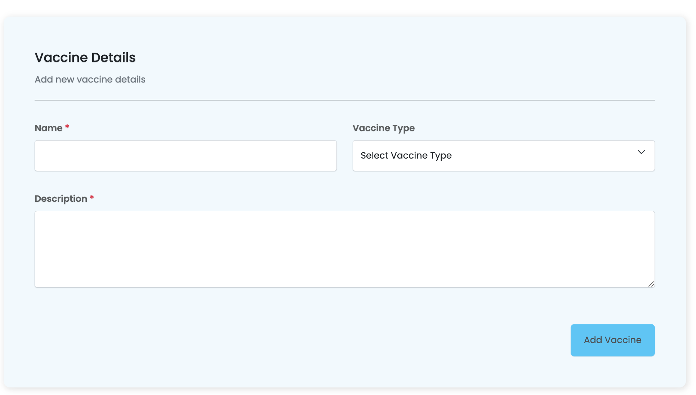

# Usage 

- Creating a basic form with Sisitech Forms is straightforward. 
- There are two ways to render myForms i.e the **single** form or the **multi-step** form. 

<br>

<br>

- In this tutorial, we will use a hospital records management system to demonstrate the library's usage. The example below shows an example to add a vaccine.

## Creating the Form Component
- After creating and serving your angular project, the first step is to create the form component in your desired directory.
- In this case we want to create an add component in the vaccine folder. Navigate to your angular project's root directory and use the Angular CLI to generate a new component named `add` as shown:

```bash
ng generate component add
```

- Once created, we start by setting up the form fields and integration before finally rendering the html.
- The steps to setting up a functional form using Sisitech forms can be generalized into three key steps:

<br>

  
## Defining Form Fields
- MyForms uses the data fields defined in the backend models of your project to generate the fields to be rendered on the form.
- MyForms assumes your project is using a [Django](https://www.djangoproject.com/) backend since the form fields are designed to take up the same structure as the options provided for Django model endpoints.
- Once we've created the component, the next step is to setup the options.ts file in your project folder in which we will copy and paste the options data provided by the Django endpoint. 


- Next, go to your specific API endpoint and click on the options button to get the options file. 

!!! note
    TODO: Update the image below to show the vaccines api endpoint


- Once copied, define and export an options object in your options file

``` ts title="vaccines/options.ts"
const filterOptions = {

}

export {
    options
}
```

- Copy the contents of the response options into your created **options.ts** file

``` ts title="vaccines/add/options.ts"
const filterOptions = {
"name": "List Create Vaccines Api",
    "description": "",
    "renders": [
        "application/json",
        "text/html"
    ],
    "parses": [
        "application/json",
        "application/x-www-form-urlencoded",
        "multipart/form-data"
    ],
    "actions": {
        "POST": {
            "id": {
                "type": "integer",
                "required": false,
                "read_only": true,
                "label": "ID"
            },
            "name": {
                "type": "string",
                "required": true,
                "read_only": false,
                "label": "Name",
                "max_length": 45
            },
            "description": {
                "type": "string",
                "required": true,
                "read_only": false,
                "label": "Description",
                "max_length": 500
            },
            "organization": {
                "type": "choice",
                "required": false,
                "read_only": false,
                "label": "Vaccine Type",
                "choices": [
                    {
                        "value": "G",
                        "display_name": "KEPI Schedule"
                    },
                    {
                        "value": "P",
                        "display_name": "Expanded Schedule"
                    }
                ]
            }
        }
    }
}

export {
    filterOptions
}
```
<br>

- The form fields that will be used to render the form can be seen in the "POST" key of the "actions" dictionary. 
- Each key-value pair in this dictionary represents the name of the field as well as the model constraints the field has.
- Once we set up the options.ts file, next is to integrate the myForms library with our project using the options.ts file we just created.

## Backend Integration

- The first step in integrating the backend is to set up the API_URL endpoints in the main app.module.ts file.
- Replace the variable API_URL in the app.module.ts page with your API's URL provided and add the myforms module as shown:

``` ts hl_lines="12 13 14 15 16 17 18 27" title="app.module.ts" linenums="1"
import { NgModule } from '@angular/core';
import { BrowserModule } from '@angular/platform-browser';
import { NgxsReduxDevtoolsPluginModule } from '@ngxs/devtools-plugin';
import { NgxsModule } from '@ngxs/store';
import { MyformModule } from '@sisitech/myform';
import { NgxsAuthModule } from '@sisitech/ngxs-auth';

import { AppRoutingModule } from './app-routing.module';
import { AppComponent } from './app.component';


export const authConfig = {
  APIEndpoint: "https://api.vaccination.wavvy.dev",
  version: "api/v1",
  tokenUrl: "o/token/",
  revokeTokenUrl: "o/revoke_token/",
  clientId: "YOUR CLIENT ID",
}

@NgModule({
  declarations: [
    AppComponent
  ],
  imports: [
    BrowserModule,
    AppRoutingModule,
    MyformModule.forChild(authConfig),
    NgxsAuthModule.forRoot(authConfig),
    NgxsModule.forRoot(),
    NgxsReduxDevtoolsPluginModule.forRoot(),

  ],
  providers: [],
  bootstrap: [AppComponent]
})
export class AppModule { }
```

- Once the API url endpoints are set, we create the necessary components needed to render myforms in the component.ts file of your form component
- But first, let's understand some key concepts about the working of myforms.

### MyForm Inputs & Outputs
- The table below shows the different inputs we need to define in our component.ts file as well as the ones we will pass to the <myforms> html module. The required inputs or shown by teh green checkmark.

| Inputs              | Is Required | Descripiton                                                                                                                                                                            | Example                           |
| :------------------ | :---------: | :------------------------------------------------------------------------------------------------------------------------------------------------------------------------------------- | :-------------------------------- |
| instanceName        |      ✅      | `@Input` The name of the form instance                                                                                                                                                 |                                   |  |
| formItems           |      ✅      | `@Input` This is used to pass the exported form options from `options.ts`                                                                                                              |                                   |
| formGroupOrder      |      ✅      | `@Input` An array within an array used to define the fields to be included and their order. More details on this input are explained below.                                            |                                   |
| name                |      ✖️      | `@Input` This is used to pass the exported form options from `options.ts`                                                                                                              |                                   |
| enableAddAnother    |      ✖️      | `@Input` Boolean field that allows you to add another form after submitting the first.                                                                                                 |
| url                 |      ✖️      | `@Input` URL path of the API endpoint                                                                                                                                                  | `/api/v1/vaccines`                |
| extraFields         |      ✖️      | `@Input` Any constant fields that are not included in the form and may be required by the API an example would be an access token                                                      | `{"token":"Ahw7HD7a"}`            |
| submitButtonText    |      ✖️      | `@Input` The text displayed in the form submit button. The default value is `Post`                                                                                                     | `Vaccine` , `Patient`, `Schedule` |
| instance            |      ✖️      | `@Input` - an object provided during update of any previously created instances to trigger edit mode                                                                                   |                                   |
| submitButtonText    |      ✖️      | The text displayed in the form submit button before the submit button text (`submitButtonText`). By default the value is `Add`, and if an `instance` is included the value is `Update` | `Add`, `Edit`, `Update`           |
| isValidationOnly    |      ✖️      | `@Input` - used to validate a form without posting to any URL e.g. in a multi-step form                                                                                                | `true` or `false`                 |
| onValidatedData     |      ✖️      | `@Output` - an event triggered on successful validation with the value of the valid form only if `isValidationOnly` is `true`                                                          |                                   |
| onPostedData        |      ✖️      | `@Output` - an event triggered with the value of the HTTP response from the API with successful status codes (`200`, `201`, `204`)                                                     |                                   |
| preSaveDataFunction |      ✖️      | `@Input` - a function that accepts and return a JSON used to manipulate the form data after successful validation before `onValidatedData` and `onPostedData`                          |                                   |
| isLoading$          |      ✖️      | `@Output` - an event triggered with the value `true` when a HTTP request is started and `false` on completion                                                                          |                                   |
| httpMethod          |      ✖️      | `@Input` - used to override the HTTP request method. Only `post`, `put` and `patch` are supported                                                                                      | `POST`, `PUT`, `PATCH`            |
| httpMethod          |      ✖️      | `@Input` - used to override the HTTP request method. Only `post`, `put` and `patch` are supported                                                                                      | `POST`, `PUT`, `PATCH`            |


#### The FormGroupOrder Array
- A formGroupOrder is an array used to define the fields to be displayed on the form as well as the orde rin which they will be displayed. 
- A formGroupOrder can be an array of **form field items**:

``` ts
formGroupOrder = [
    ['first_name', 'middle_name', 'last_name'],
    ['phone', 'streams'],
    ['sms']
  ]
```

!!! note
    The list of field items represents the form fields that will be rendered on each row of the form as well as the order in which they will appear.
    A new list of field items listed, means a new row to be rendered on the form.


!!! caution
    Make sure your array within an array **formGroupOrder** is separated with commas. 
  
- A formGroupOrder can also be an array of **MyFormSection objects**. 
- A MyFormSection object is used to allow for multiple forms in one big form. 
- Within a MyFormSection object, you can define the form details for each form within a multi-form setup. 
- MyFormSection object takes a title and subtitle for that formSection as well as the formGroupOrder to be displayed in that form as shown:

``` ts
section1: MyFormSection = {
    title: "Vaccine  Details",
    subTitle: " vaccine details",
    formGroupOrder: [
      [
        'name',
        'organization'],
      ['description']
    ]
  }

  formGroupOrder = [
    this.section1
  ]
```
- Now that we've understood the different inputs that myform takes, let's look at how to set up the component file and finally render the form using html.

## Rendering the form

### Single Form

- The code below shows an example for how to set up a **single form** in html. The different inputs being passed are defined in the table above. We call the <app-myform></app-myform> module to define a single form as shown:

``` html title="vaccines/add/add.component.html"
  <app-myform instanceName="Vaccine @name#" name="vac" [enableAddAnother]="true" [extraFields]="extra_fields"
      [formItems]="formItems" [url]="url" (onValidatedData)="onValidatedData($event)" [submitButtonText]="'Vaccine'"
      [formGroupOrder]="formGroupOrder" [hideButtons]=false [instance]="instance"
      (onPostedData)="onVaccineCreated($event)">
    </app-myform>
```
- The inputs being passed above in the html are defined in the component.ts file of this component. The code below shows an example of how these inputs are defined:
  
``` ts
collapseFilters = false
formItems: any = filterOptions;
validateOnly = true
url: string = "api/v1/vaccines/"
extra_fields: any
originalInstance: any
providedInstance: any
id: any = ""

section1: MyFormSection = {
    title: "Vaccine  Details",
    subTitle: " vaccine details",
    formGroupOrder: [
      [
        'name',
        'organization'],
      ['description']
    ]
  }

  formGroupOrder = [
    this.section1
  ]

  ...

  onValidatedData(data: any) {
    console.log(data)
  }

  onVaccineCreated(patient: any) {
    console.log(patient)
    window.history.back();
  }
```

- We passed the filterOptions we defined in the options.ts file to the formItems variable. As seen, the names within the formGroupOrder are the same names sourced from the options.ts file.
- The final form will be served as follows:



### Multi-step Form
- For a multi-step form, we call the <sistch-multistep-form></sistch-multistep-form> in html as shown. 
- As you can see, most of the inputs being passed to the multi-step form are being abstarcted in the [options] input to which we pass the multiStepForm variable we will soon define in the component file:

``` html title="vaccines/add/add.component.html"
<sistch-multistep-form [instance]="instance" (onPostedData)="onPatientCreated($event)" [options]="multiStepForm">
</sistch-multistep-form>
```

- The inputs being passed above in the html are defined in the component.ts file of this component. 
- The code below shows an example of how these inputs are defined. 
- In this case, we first define each individual section using a MyFormSection object. Once done, we create the multiStepForm variable that houses all our configurations:

``` ts
  filterOptions: any = filterOptions
  url: string = "api/v1/patients/"
  instance: any
 
  section1: MyFormSection = {
    title: "Personal Details",
    subTitle: this.actionName + " patient's name, gender and more personal information",
    formGroupOrder: [
      ['first_name', 'middle_name', 'last_name'],
      ['dob', 'gender'],
    ]
  }
  section2: MyFormSection = {
    title: "Parent / Guardian  Details",
    subTitle: this.actionName + " parent or guardian details",
    formGroupOrder: [
      ['guardian_name', 'guardian_email', 'guardian_phone'],
      ['sub_county', 'guardian_relationship']
    ]
  }
  section3: MyFormSection = {
    title: "Health Professional’s Declaration",
    subTitle: "I certify that the information I have provided in this form is true and correct. I have obtained proof of the vaccination(s) given.",
    formGroupOrder: [
      ['medical_license_number'],
      ['i_have_read']
    ]
  }

  sectionFormGroup: MyFormSection[] = [
    this.section1, this.section2
  ]

  multiStepForm: MutliStepForm = {
    url: "api/v1/patients/",
    options: options,
    submitButtonText: "Patient",
    forms: [
      {
        stepTitle: "Personal Details",
        sections: [this.section1]
      },
      {
        stepTitle: "Parent / Guardian  Details",
        sections: [this.section2]
      },
      {
        stepTitle: "Health Professional’s Declaration",
        sections: [this.section3]
      },
    ]
  }

  ...

  onPatientCreated(patient: any) {
    console.log(patient)
    if (patient && patient.alert_notification) {
      patient.alert_notification.message = "Patient Id: @id - @full_name @action#"
    }
    // window.history.back();
    // console.log(this.previousService.getPreviousUrl())

    this.router.navigate([this.previousService.getPreviousUrl()], { state: patient })
  }

  formChanges(form: any) {
    console.log(form)
  }
```
- The final form will be served as follows:


**Useful Links**
<br>

- [Overview](../myForms/overview.md): Introduction to myForms.
- [Getting Started](../myForms/gettingStarted.md): Learn how to install and set up Sisitech Forms in your project.
- [Under the Hood](../myForms/underTheHood.md): Dive into the details of the library's functions, classes, and components.
- [Examples](../myForms/examples.md): See real-world examples of Sisitech Forms in action.