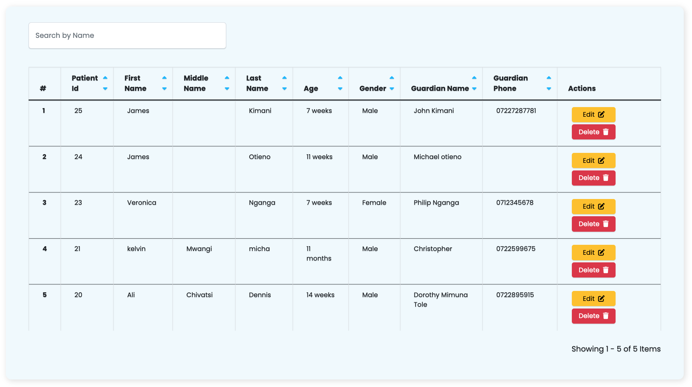

# Overview

- Welcome to [Sisitech MyTables](https://github.com/sisitech/mytables/pkgs/npm/tables), your go-to library for simplifying data display in web development. 
- Sisitech Tables allows developers and engineers to structure data such as text, images, links etc into rows and columns. The point of a table is that it is rigid. Information is easily interpreted by making visual associations between row and column headers.
- When implemented correctly, HTML tables are handled well by accessibility tools such as screen readers, so a successful HTML table should enhance the experience of sighted and visually impaired users alike.

### Key Features and Benefits:

1. **Effortless Data Presentation**: Sisitech MyTables simplifies the process of displaying data in web applications. With an intuitive API, developers can effortlessly structure and present data in rows and columns, reducing development time and complexity.
2. **Enhanced User Experience**: Create visually engaging and accessible tables that improve the user experience for both sighted and visually impaired users. MyTables ensures that data is well-organized and easily interpretable, making it a valuable tool for accessibility-conscious developers.
3. **Interactive Data Interpretation**: Enable users to make meaningful associations between row and column headers, enhancing data interpretation. Sisitech MyTables provides the rigidity and structure needed for data visualization, making information easily digestible.
4. **Responsive and Accessible**: MyTables is designed to be responsive and works well with various devices and screen sizes. It also plays nicely with accessibility tools, such as screen readers, to ensure that your tables are usable by a wide range of users.
5. **Flexible Data Display**: Tailor your data presentation to your specific project requirements. Sisitech MyTables offers customization options, allowing you to seamlessly integrate tables into the look and feel of your web application.

 

Explore the following sections of this documentation to get started with Sisitech Tables:
 

- [Getting Started](../myTables/gettingStarted.md): Learn how to install and set up Sisitech Tables in your project.
- [Usage](../myTables/usage.md): Discover how to create, customize, and work with tables using our library.
- [Under the Hood](../myTables/underTheHood.md): Dive into the details of the library's functions, classes, and components.
- [Examples](../myTables/examples.md): See real-world examples of Sisitech Tables in action.
- [FAQs](../myTables/faqs.md): Find answers to common questions and troubleshooting tips.