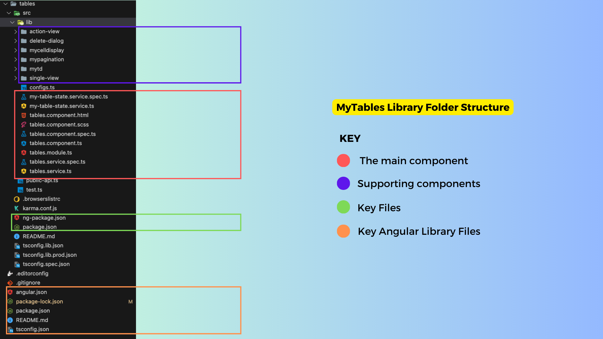
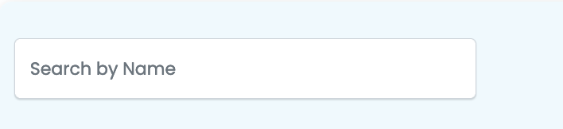
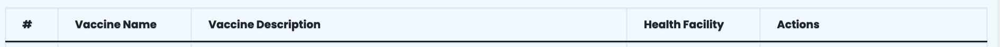
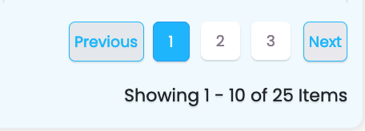
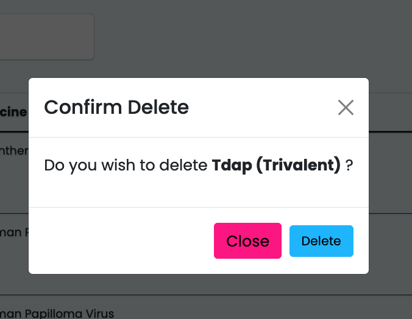

# Under The Hood

## Introduction
- Sisitech MyTables is an extension of the basic html table element with a more decoupled approach and additional functionality.
- The decoupled approach breaks down a table into it's basic elements i.e (headers and rows) which allows us to  control the inner cells and headers of our tables.
- The more functional components add necessary functionality to our tables such as pagination, search, custom button functions among others.
- The easiest way to understand the inner workings of MyTables is to look at the html component of the key folder within the module i.e table.component.html.
- But first, let's dive into the folder structure of the MyTables module to know where different folders and files are located and also to understand the importance of some of them.

## Folder Structure
- The image below shows the folder structure of the MyTables library and a brief explanation of what each folder/file is about:
  <br>
 

  <br>

- The table below gives a more detailed breakdown of the key files in the structure above:
  <br>

 | Folder/File               | Description                                                                                                      |
 | ------------------------- | ---------------------------------------------------------------------------------------------------------------- |
 | 🗒️ MyTables.component.html | The main MyTables component files. The .html file contains the HTML code that renders the table on the frontend. |
| 🗒️ MyTables.component.ts   | The .ts file contains the key functions and inputs that handle the data to be shown on the tables    |
| 🗒️ MyTables.component.scss | Handles mytables styling                                                                                                   |
| 🗒️ MyTables.interface.ts  | The interface.ts file contains the key classes representing data objects used in MyTables.             |
| 🗒️ MyTables.module.ts    | The module.ts file contains the modules MyTables is dependent on.                                       |
| 🗒️ MyTables-state.service.ts    | The service.ts file contains the getters fro differnet data points in mytables.                                       |
| 📁 action-view       | The `ActionViewComponent` is a component that is designed to render dynamic action buttons based on specified conditions. These action buttons trigger various actions, including data manipulation, by emitting events to the `TablesService`.                           |
| 📁 delete-dialog              | The component defines the structure for a modal dialog component used for confirming the deletion of a specific item.                                |
| 📁 mycelldisplay      | This component defines the structure for a dynamic display component, mycelldisplay, which renders content based on the valueType. It displays various content types differently, such as arrays, boolean values, and default values |
| 📁 mypagination                | A supporting component that defines a pagination component, mypagination, which displays navigation controls for moving between pages of data.  |
| 📁 mytd                | A supporting component that includes app-mycelldisplay, that is used to display cell values within a table or data grid.  |
| 📁 single-view                | A component that provides the structure for displaying data in a carousel when no errors or loading are present, and switches to error or loading views based on conditions.  |
| 🗒️ public.api.ts         | The file that exposes the different components within the MyTables library. Only the files listed here can be referenced by consumers of the library. |
| 🗒️ ng.package.json       | The files that control the naming and versioning details of the MyTables library.                           |
 
<br>


## Key Files & Components


### tables.component.html

- The HTML file gives a brief overview of how the components come together:

1. **Search and Export Section**: This section includes a search form for filtering the data and buttons to trigger data export.

<br>
 
<br>

1. **Toast Messages**: The `sistch-toast-list` component is used to display alert messages (toast notifications).

2. **Table**: The main table element is used to present the tabular data. It includes:

   - **Table Headers**: The table headers are generated dynamically based on the `tableHeaders` array. Users can click on column headers to sort the data.

   - **Table Rows**: Data rows are generated dynamically based on the `results` array. Each cell in the table contains an `app-mytd` component, which can be clicked to perform actions.
<br>
 
<br>
   - **Loading State**: When the data is being loaded, a loading indicator is shown, replacing the table.

   - **No Data Message**: If there's no data to display, an appropriate message is shown. You can choose between using alerts or plain text for displaying errors and no-data messages.

3. **Pagination Section**: At the bottom of the page, there is a pagination component (`app-mypagination`) for navigating between pages of data.

<br>
 
<br>

4. **Delete Dialog Modal**: A dialog modal (`sistch-tables-dialog`) is included for confirming delete actions, and it listens to various events to manage the delete operation.
   
<br>
 
<br>


### Key Inputs & Outputs

**Inputs**
- Below is a table describing the inputs and whether they're required:
<br>

| Input                   | Required | Description                                                                            |
| ----------------------- | -------- | -------------------------------------------------------------------------------------- |
| name                    | No       | The name of the component. Default is "form."                                          |
| useAlertsForErrors      | No       | If true, use alert messages for errors; otherwise, display plain text.                 |
| alerts                  | No       | An array of alert messages to display.                                                 |
| noDataErrorMessage      | No       | The message to display when there's no data available. Default is "No data available." |
| listTypeUrl             | Yes      | The URL for fetching the list data.                                                    |
| instanceUrl             | Yes      | The URL for fetching instance data.                                                    |
| headersOrder            | No       | An array specifying the order of table headers.                                        |
| tableFilters            | No       | An array of filter options for the table.                                              |
| page_size               | No       | The number of items to display per page. Default is 10.                                |
| enableDelete            | No       | Enable or disable the delete feature.                                                  |
| enableView              | No       | Enable or disable the view feature.                                                    |
| enableAdd               | No       | Enable or disable the add feature.                                                     |
| extraFields             | No       | Additional fields to include in the data.                                              |
| enableOrderBy           | No       | Enable or disable ordering by column.                                                  |
| selectedOrderByField    | No       | The selected column for ordering.                                                      |
| orderByDirection        | No       | The direction of ordering, either "ASC" or "DESC." Default is "ASC."                   |
| groupedBy               | No       | An array of columns to group the data by.                                              |
| orderByFields           | No       | An array of columns that support ordering.                                             |
| enableEdit              | No       | Enable or disable the edit feature.                                                    |
| deleteFieldDisplayField | No       | The field used to display a confirmation message for deletion. Default is "id @id."    |
| refresh                 | No       | A trigger to refresh the table.                                                        |
| headers                 | Yes      | An array of table headers.                                                             |
| formFilters             | No       | Filter options for the table data.                                                     |
| showNumbering           | No       | Whether to display row numbering.                                                      |
| enableSearch            | No       | Enable or disable the search feature.                                                  |
| enableExport            | No       | Enable or disable data export.                                                         |
| searchFieldName         | No       | The field used for searching. Default is "search."                                     |
| deletePreText           | No       | The pre-text message for delete confirmation. Default is "Do you wish to delete."      |
| searchFieldNameMessage  | No       | Message for the search field.                                                          |
| refreshIntervalDuration | No       | The duration for auto-refresh in milliseconds.                                         |

<br>

**Outputs**
<br>

- Below is a table describing the outputs:

| Output          | Description                                                                      |
| --------------- | -------------------------------------------------------------------------------- |
| actionsEvent    | An event emitter for actions such as editing, deleting, viewing, or adding data. |
| deletedEvent    | An event emitter for the item that has been deleted.                             |
| selectRow       | An event emitter for selecting a specific row.                                   |
| exportTriggered | An event emitter triggered when exporting data.                                  |
| isLoading       | An event emitter for the loading status of the table.                            |
| onLengthLoaded  | An event emitter for the length of loaded results.                               |

<br>

### Key Functions
- Below is a table describing key functions, what they do, what parameters they take, and what they give back:

> `getAlertMessage(alert: any)`: Retrieves the message from an alert object. Parameters: `alert` - the alert object. Returns the interpolated message.

> `getOrderByStyle(direction: string, header: any)`: Determines the style for ordering buttons. Parameters: `direction` - ordering direction ("ASC" or "DESC"), `header` - the header data. Returns an object with style properties.

> `setOrderBy(direction: string, header: any)`: Sets the ordering of data. Parameters: `direction` - ordering direction ("ASC" or "DESC"), `header` - the header data. Triggers data refresh.

> `setLoaderStatus(status: boolean)`: Sets the loading status of the table. Parameters: `status` - true to indicate loading, false otherwise.

> `onPageSelect(page: number)`: Handles page selection. Parameters: `page` - the selected page number. Triggers data retrieval.

> `toTitleCase(str: string)`: Converts a string to title case. Parameters: `str` - the input string. Returns the title-cased string.

> `getColumnName(header: any)`: Retrieves the column name from the header data. Parameters: `header` - the header data. Returns the column name as a string.

> `showHeaderOrderBy(header: any)`: Checks whether to show the ordering for a specific header. Parameters: `header` - the header data. Returns true if ordering should be displayed, false otherwise.

> `getHeaderTitle(header: any)`: Retrieves

<br>

## Supporting Components

### ActionViewComponent

- The `ActionViewComponent` is an Angular component that is designed to render dynamic action buttons based on specified conditions, such as the value of the `displayHiddenValue`. 
- These action buttons trigger various actions, including data manipulation, by emitting events to the `TablesService`. 
- It also includes features like handling download links and customized button appearances.
- Below is a brief table that summarizes the different action buttons in the `ActionViewComponent` along with their associated functions and any required parameters:

<br>

| Action Button | Function            | Parameters                    |
| ------------- | ------------------- | ----------------------------- |
| 'P'           | Page Action         | None                          |
| 'C'           | Complete Action     | None                          |
| 'TA'          | Custom Action (TA)  | None                          |
| 'AT'          | Custom Action (AT)  | None                          |
| 'IP'          | Custom Action (IP)  | None                          |
| 'CBU'         | Custom Button (CBU) | None                          |
| 'Edit'        | Edit Action         | None                          |
| 'Add'         | Add Action          | None                          |
| 'View'        | View Action         | None                          |
| 'Delete'      | Delete Action       | None                          |
| true          | True Action         | None                          |
| false         | False Action        | None                          |
| 'download'    | Download Action     | downloadUrl, downloadCssClass |

!!! note
    These parameters can be set based on the specific functionality you want to achieve with the buttons. The 'download' action button requires the `downloadUrl` and `downloadCssClass` parameters, which are used to create a download link with a specified URL and CSS class.

<br>

### Delete Dialog
- The DeleteDialogComponent is an Angular component used to handle and display a confirmation dialog for deleting items. 
  
<br>
 
<br>

- Key features and takeaways from this component include:

<br>

  - It communicates with the MyTableStateService and TablesService to manage the deletion process and fetch necessary data.
  - The component's behavior is controlled by properties like isLoading, hasErrors, and shouldOpen
  - It allows customization of the modal title and the displayed item's name.
  - The onDelete method is responsible for initiating the deletion process when the user confirms the action.
  - The component emits events to indicate the modal's status changes.
  - It handles error messages when deletion fails, providing user-friendly feedback.

- The DeleteDialogComponent serves as a reusable confirmation dialog for deletion actions within an Angular application, enhancing the user experience and facilitating safe data management.
- Here's a table that describes the inputs and outputs for the `<sistch-tables-dialog>` component:

| Input                       | Description                                                   |
| --------------------------- | ------------------------------------------------------------- |
| `[name]`                    | Specifies the name or identifier for the dialog component.    |
| `[deletePreText]`           | Optional text displayed before the item's name in the dialog. |
| `[deleteFieldDisplayField]` | Defines how the item's name is displayed in the dialog.       |
| `[data]`                    | Data object representing the item to be deleted.              |

| Output             | Description                                                                                                                          |
| ------------------ | ------------------------------------------------------------------------------------------------------------------------------------ |
| `(onStatusChange)` | Event emitted when the modal's status changes (e.g., "open" or "close"). It provides the status as an argument to the event handler. |

### MyCellDisplay
- The HTML file contains a dynamic content display component that adapts its rendering based on the valueType. 
- When isActions is set to true, it includes app-action-view components for displaying action buttons. 
- The component handles different value types (arrays, booleans, and default) and formats numeric values using the Intl.NumberFormat. 
- It also accommodates date values (commented out) and boolean values with corresponding icons.
- The TypeScript file for mycelldisplay contains the logic for formatting and rendering dynamic content based on the valueType. 
- It formats numeric values using the Intl.NumberFormat, handles different value types, and accommodates arrays and booleans. 
- The component also accepts input properties like columnConfig and rowData, and it can render action buttons when isActions is set to true.


### Pagination
- The component facilitates navigation through a list of items. It offers standard and cursor-based pagination options. 
- The component features "Previous" and "Next" buttons, as well as a page range indicator that displays the current items being shown.
- It adapts its display based on various conditions, including the availability of previous and next pages, and the total number of pages.

<br>
 
<br>

- The code block below shows an example of how it's called in table.component.html:

```HTML
 <app-mypagination [selectedPage]="page" (onCursorSelected)="onCursorSelected($event)" [pageSize]="page_size"
        (onPageSelect)="onPageSelect($event)" [resultsMeta]="resultsMeta" *ngIf="!loading"></app-mypagination>
```
<br>

- Here's a table that describes the inputs and outputs for the `<app-mypagination>` component, along with brief explanations of what the different functions do:

| Input            | Description                                                            |
| ---------------- | ---------------------------------------------------------------------- |
| `[selectedPage]` | Specifies the currently selected page within the pagination component. |
| `[pageSize]`     | Sets the number of items displayed per page.                           |
| `[resultsMeta]`  | Contains metadata about the results, such as the total item count.     |

| Output               | Description                                                                                                                            |
| -------------------- | -------------------------------------------------------------------------------------------------------------------------------------- |
| `(onPageSelect)`     | Event emitted when a new page is selected. It provides the selected page number as an argument to the event handler.                   |
| `(onCursorSelected)` | Event emitted when a cursor-based navigation action is performed. It provides the selected cursor as an argument to the event handler. |

- The list below highlights the key functions within myPagination:

> `scrollPage(addPage: number)`: This function scrolls to a specific page by adding the specified number of pages to the currently selected page. It takes into account whether the new page is within the total page range and ensures the selected page is updated accordingly.

> `selectPage(page: number)`: This function selects a specific page by emitting an event with the chosen page number. It also checks whether the selected page is the same as the current page to prevent unnecessary updates.

> `selectCursorUrl(cursorUrl: string)`: This function handles the selection of cursor-based navigation by extracting the cursor value from a URL and emitting it as an event. It is typically used for cursor-based pagination.

>`checkIsSelected(page: number)`: This function checks whether a specific page is currently selected and returns a boolean value accordingly.

<br>

### mytd
- The HTML file contains the app-mycelldisplay compoenent, which is responsible for displaying cell values in a table or data grid. 
- It takes several input parameters, including columnConfig (configuration for the column), rowData (the data to be displayed), and isActions (a boolean flag indicating whether the cell represents an action). 
- The component's main function is to render cell values according to the provided configuration, which can include handling different data types, applying display names, and handling array data.

<br>
 
<br>

- The code block shows an example usage in table.component.html:

```HTML
 <app-mytd [columnConfig]="header.title" [isHeaderCell]=true></app-mytd>
```

- Here's an inputs and outputs description table for the provided code block:

**Inputs:**

| Input Name     | Type    | Description                                                                                                                                                                          |
| -------------- | ------- | ------------------------------------------------------------------------------------------------------------------------------------------------------------------------------------ |
| `columnConfig` | any     | Configuration for the column, specifying how the data should be displayed. It can be of various types, including objects with additional information.                                |
| `isHeaderCell` | boolean | A boolean flag that indicates whether the cell is a header cell (true) or a regular data cell (false). It determines the display behavior and styling of the cell based on its type. |


!!! note
    There are no defined outputs for this component in the provided code block, as it primarily focuses on displaying data and configuring the appearance of cells.

<br> 


**Useful Links**
<br>

- [Overview](../MyTables/overview.md): Introduction to MyTables.
- [Getting Started](../MyTables/gettingStarted.md): Learn how to install and set up Sisitech Forms in your project.
- [Usage](../MyTables/usage.md): Discover how to create, customize, and work with forms using our library.
- [Examples](../MyTables/examples.md): See real-world examples of Sisitech Forms in ac