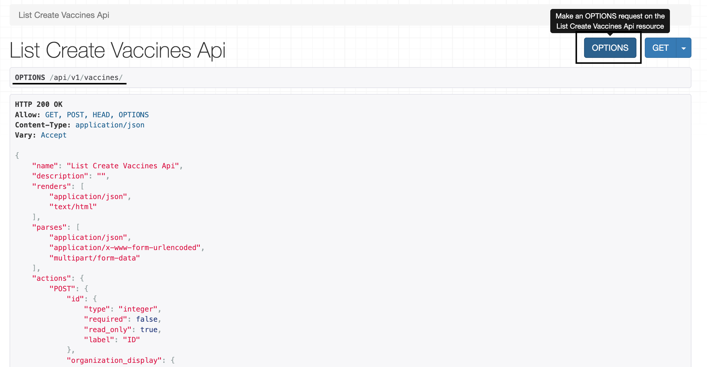

# Sisitech MyForms

## Introduction

- Welcome to Sisitech Forms, your go-to library for simplifying form management in web development. Sisitech Forms is a powerful and versatile forms library designed to streamline the way users interact with web pages by facilitating the submission of data to servers for processing. 


### Key Features and Benefits:

1. **Effortless Form Handling**: Sisitech Forms takes the complexity out of managing forms in web applications. With a straightforward and intuitive API, developers can easily create and manage forms, saving valuable development time.
2. **Enhanced Validation**: Our library offers robust front-end and server-side validation capabilities, ensuring that data submitted through your forms is accurate, secure, and compliant with your application's requirements.
3. **Streamlined HTTP Requests**: Sisitech Forms simplifies the process of sending and receiving data between the client and server. Handle HTTP requests with ease, making it effortless to interact with your backend services.
4. **Customization Options**: Tailor the forms to match your project's unique requirements. Our library provides a range of customization options, allowing you to create forms that seamlessly integrate with your application's look and feel.

- Explore the following sections of this documentation to get started with Sisitech Forms:
  - [Getting Started](#getting-started): Learn how to install and set up Sisitech Forms in your project.
  - [Usage](#usage): Discover how to create, customize, and work with forms using our library.
  - [API Reference](): Dive into the details of the library's functions, classes, and components.
  - [Examples](): See real-world examples of Sisitech Forms in action.
  - [FAQs](): Find answers to common questions and troubleshooting tips.

## Getting Started

### Installation
**Setting up Sisitech npm registry**
- Before installing myforms, make sure you've setup Sisitech's npm registry on your local computer. Click [Switch to Github NPM Package Registry](https://sisitech.github.io/SisitechDocs/Server%20Admin/npm%20registry/) to learn more.

**Basic Installation**
- Once installed to start using Sisitech Forms in your project, you'll need to install it via npm or package.json. 
- Open your terminal and run one of the following commands, depending on your package manager of choice:

```bash
# Using npm
npm install @sisitech/myform@0.3.1
```

- You could also directly add it to your package.json as follows

```json
# Adding it to package.json
"@sisitech/myform": "0.3.1"
```

- Check the [MyForms](https://github.com/orgs/sisitech/packages/npm/package/myform) official package page to get the latest version of myforms.
- This will add Sisitech Forms to your project's dependencies, making it available for use in your code.

## Usage
- Creating a basic form with Sisitech Forms is straightforward. 
- We will use a hospital records management system to demonstrate the library's usage. The example below shows an example to add a vaccine.

### Integrating the backend

#### Set up the API_URL endpoints and MyFormsModule

- Replace the variable API_URL in the app.module.ts page with your API's URL provided and add the myf orms module as shown.

``` ts hl_lines="12 13 14 15 16 17 18 27" title="app.module.ts" linenums="1"
import { NgModule } from '@angular/core';
import { BrowserModule } from '@angular/platform-browser';
import { NgxsReduxDevtoolsPluginModule } from '@ngxs/devtools-plugin';
import { NgxsModule } from '@ngxs/store';
import { MyformModule } from '@sisitech/myform';
import { NgxsAuthModule } from '@sisitech/ngxs-auth';

import { AppRoutingModule } from './app-routing.module';
import { AppComponent } from './app.component';


export const authConfig = {
  APIEndpoint: "https://api.vaccination.wavvy.dev",
  version: "api/v1",
  tokenUrl: "o/token/",
  revokeTokenUrl: "o/revoke_token/",
  clientId: "RJ2U5wgrjmzKbf1RE1vRqgQ6kLeqbIOL5Ua6m3mv",
}

@NgModule({
  declarations: [
    AppComponent
  ],
  imports: [
    BrowserModule,
    AppRoutingModule,
    MyformModule.forChild(authConfig),
    NgxsAuthModule.forRoot(authConfig),
    NgxsModule.forRoot(),
    NgxsReduxDevtoolsPluginModule.forRoot(),

  ],
  providers: [],
  bootstrap: [AppComponent]
})
export class AppModule { }
```

#### Creating the Options.ts file**
- Create an options.ts file 


- Go to your specific API endpoint and click on the options button to get the options file. 



- Define and export an options object in your options file

``` ts title="vaccines/options.ts"
const filterOptions = {

}

export {
    options
}


```

- Copy the contents of the response options into your created **options.ts** file

``` ts title="vaccines/add/options.ts"
const filterOptions = {
"name": "List Create Vaccines Api",
    "description": "",
    "renders": [
        "application/json",
        "text/html"
    ],
    "parses": [
        "application/json",
        "application/x-www-form-urlencoded",
        "multipart/form-data"
    ],
    "actions": {
        "POST": {
            "id": {
                "type": "integer",
                "required": false,
                "read_only": true,
                "label": "ID"
            },
            "name": {
                "type": "string",
                "required": true,
                "read_only": false,
                "label": "Name",
                "max_length": 45
            },
            "description": {
                "type": "string",
                "required": true,
                "read_only": false,
                "label": "Description",
                "max_length": 500
            },
            "organization": {
                "type": "choice",
                "required": false,
                "read_only": false,
                "label": "Vaccine Type",
                "choices": [
                    {
                        "value": "G",
                        "display_name": "KEPI Schedule"
                    },
                    {
                        "value": "P",
                        "display_name": "Expanded Schedule"
                    }
                ]
            }
        }
    }
}

export {
    filterOptions
}

```

---

### Setting up the Frontend
- Add `<app-myform></app-myform>` tag to the **html** file

- Refer to the table below for the various basic input and output options. 

| Option              | Is Required | Descripiton                                                                                                                                                                            | Example                           |
| :------------------ | :---------: | :------------------------------------------------------------------------------------------------------------------------------------------------------------------------------------- | :-------------------------------- |
| instanceName           |      ✅      | `@Input` The current form instance                                                                                                              |                                   |                                  |
| formItems           |      ✅      | `@Input` This is used to pass the exported form options from `options.ts`                                                                                                              |                                   |
| formGroupOrder      |      ✅      | `@Input` An array within an array used to define the fields to be included and their order                                                                                             |                                   |
| name           |      ✖️      | `@Input` This is used to pass the exported form options from `options.ts`                                                                                                              |                                   |
| enableAddAnother           |      ✖️      | `@Input` Boolean field that allows you to add another form after submitting the first.                                                                                                                                                                                            | 
| url                 |      ✖️      | `@Input` URL path of the API endpoint                                                                                                                                                  | `/api/v1/vaccines`                |
| extraFields         |      ✖️      | `@Input` Any constant fields that are not included in the form and may be required by the API an example would be an access token                                                      | `{"token":"Ahw7HD7a"}`            |
| submitButtonText    |      ✖️      | `@Input` The text displayed in the form submit button. The default value is `Post`                                                                                                     | `Vaccine` , `Patient`, `Schedule` |
| instance            |      ✖️      | `@Input` - an object provided during update of any previously created instances to trigger edit mode                                                                                   |                                   |
| submitButtonText |      ✖️      | The text displayed in the form submit button before the submit button text (`submitButtonText`). By default the value is `Add`, and if an `instance` is included the value is `Update` | `Add`, `Edit`, `Update`           |
| isValidationOnly    |      ✖️      | `@Input` - used to validate a form without posting to any URL e.g. in a multi-step form                                                                                                | `true` or `false`                 |
| onValidatedData     |      ✖️      | `@Output` - an event triggered on successful validation with the value of the valid form only if `isValidationOnly` is `true`                                                          |                                   |
| onPostedData        |      ✖️      | `@Output` - an event triggered with the value of the HTTP response from the API with successful status codes (`200`, `201`, `204`)                                                     |                                   |
| preSaveDataFunction |      ✖️      | `@Input` - a function that accepts and return a JSON used to manipulate the form data after successful validation before `onValidatedData` and `onPostedData`                          |                                   |
| isLoading$          |      ✖️      | `@Output` - an event triggered with the value `true` when a HTTP request is started and `false` on completion                                                                          |                                   |
| httpMethod          |      ✖️      | `@Input` - used to override the HTTP request method. Only `post`, `put` and `patch` are supported                                                                                      | `POST`, `PUT`, `PATCH`            |
| httpMethod          |      ✖️      | `@Input` - used to override the HTTP request method. Only `post`, `put` and `patch` are supported                                                                                      | `POST`, `PUT`, `PATCH`            |

<br>

#### Creating the formGroupOrder
- A formGroupOrder is an array within an array used to define the fields to be displayed on the form. The formGroupOrder can take a group of form field items or MyFormSection objects. 
- A MyFormSection object is used to allow for multiple forms in one big form. Within a MyFormSection object, you can define the form details for each form within a multi-form setup. The object takes a title and subtitle for that formsection as well as the formGroupOrder to be displayed in that form.

##### Single-Form
- The example below shows an example of a how to define a **single form**:
``` ts
collapseFilters = false
formItems: any = filterOptions;
validateOnly = true
url: string = "api/v1/vaccines/"
extra_fields: any
originalInstance: any
providedInstance: any
id: any = ""

section1: MyFormSection = {
    title: "Vaccine  Details",
    subTitle: " vaccine details",
    formGroupOrder: [
      [
        'name',
        'organization'],
      ['description']
    ]
  }

  formGroupOrder = [
    this.section1
  ]
```

##### Multi-Step-Form
- The example below shows an example of how to define multiple sections for a **multi-step form**:

``` ts
filterOptions: any = filterOptions
  collapseFilters = false
  filterGroupOrder = [
    ['grouping', 'paginator'],
    ['region', 'district', 'gender'],
    ['school', 'base_class', 'status']
  ]

  formItems: any = options;
  validateOnly = true
  url: string = "api/v1/patients/"
  extra_fields: any
  originalInstance: any
  id: any = ""
  providedInstance: any
  formGroupOrder = [
    ['first_name', 'middle_name', 'last_name'],
    ['phone', 'streams'],
    ['sms']
  ]

  section1: MyFormSection = {
    title: "Personal Details",
    subTitle: this.actionName + " patient's name, gender and more personal information",
    formGroupOrder: [
      ['first_name', 'middle_name', 'last_name'],
      ['dob', 'gender'],
    ]
  }
  section2: MyFormSection = {
    title: "Parent / Guardian  Details",
    subTitle: this.actionName + " parent or guardian details",
    formGroupOrder: [
      ['guardian_name', 'guardian_email', 'guardian_phone'],
      ['sub_county', 'guardian_relationship']
    ]
  }
  section3: MyFormSection = {
    title: "Health Professional’s Declaration",
    subTitle: "I certify that the information I have provided in this form is true and correct. I have obtained proof of the vaccination(s) given.",
    formGroupOrder: [
      ['medical_license_number'],
      ['i_have_read']
    ]
  }

  sectionFormGroup: MyFormSection[] = [
    this.section1, this.section2
  ]

  multistepForm: MutliStepForm = {
    url: "api/v1/patients/",
    options: options,
    submitButtonText: "Patient",
    forms: [
      {
        stepTitle: "Personal Details",
        sections: [this.section1]
      },
      {
        stepTitle: "Parent / Guardian  Details",
        sections: [this.section2]
      },
      {
        stepTitle: "Health Professional’s Declaration",
        sections: [this.section3]
      },
    ]
  }
```

!!! caution
    Make sure your array within an array **formGroupOrder** is separated with commas. 

!!! note
    The options `first_name`, `middle_name` etc are the names for the `POST` object in the `options.ts`

#### HTML Setup Example

##### Single-Form
- An example for how to set up a **single form** in html:

``` html title="vaccines/add/add.component.html"
  <app-myform instanceName="Vaccine @name#" name="vac" [enableAddAnother]="true" [extraFields]="extra_fields"
      [formItems]="formItems" [url]="url" (onValidatedData)="onValidatedData($event)" [submitButtonText]="'Vaccine'"
      [formGroupOrder]="formGroupOrder" [hideButtons]=false [instance]="instance"
      (onPostedData)="onVaccineCreated($event)">
    </app-myform>
```
##### Multi-Step-Form
- An example for how to set up a **multi-step form** in html:

``` html title="vaccines/add/add.component.html"
<sistch-multistep-form [instance]="instance" (onPostedData)="onPatientCreated($event)" [options]="multistepForm">
</sistch-multistep-form>
```

#### TS Setup Example

##### Single-Form
- An example for how to set up a **single form** in typescript:

``` ts title="vaccines/add/add.component.ts"
import { Component, OnInit } from '@angular/core';
import { MyFormSection } from '@sisitech/myform';
import { FormControl, FormGroup } from '@angular/forms';
import { filterOptions } from '../options';
import { ActivatedRoute, Router } from '@angular/router';
import { Subscription } from 'rxjs/internal/Subscription';

@Component({
  selector: 'app-add',
  templateUrl: './add.component.html',
  styleUrls: ['./add.component.scss']
})
export class AddComponent implements OnInit {

  title = "Add New Vaccine"
  subtitle = "Add new vaccine details in the form below"
  buttonText = "New Vaccine"
  buttonLink = "/vaccines/add"
  instance: any
  routeParamSub?: Subscription;
  routeSub?: Subscription;
  actionName: string = "Add"

  constructor(private route: ActivatedRoute, private router: Router) {
    this.routeParamSub = this.route.queryParams.subscribe(params => {
      if (this.router.getCurrentNavigation()?.extras.state) {
        const instance = this.router.getCurrentNavigation()?.extras.state;
        if (instance?.hasOwnProperty("id")) {
          // this.setIntance(instance)
          this.providedInstance = instance
        }
      }
    })

    this.routeSub = this.route.params.subscribe(params => {
      console.log(params);
      this.id = params['id'];

      if (this.id) {
        this.actionName = "Update"

        this.title = this.actionName + " Vaccine Details"
        this.subtitle = this.actionName + " vaccine details in the form below"
        this.section1.subTitle = this.actionName + " vaccine details"
      }
    });
  }

  ngOnDestroy(): void {
    this.routeParamSub?.unsubscribe()
    this.routeSub?.unsubscribe()
  }

  ngOnInit(): void {
    this.formGroup.valueChanges.subscribe(res => {
      console.log(res)
    })
  }


  collapseFilters = false
  formItems: any = filterOptions;
  validateOnly = true
  url: string = "api/v1/vaccines/"
  extra_fields: any
  originalInstance: any
  providedInstance: any
  id: any = ""

  section1: MyFormSection = {
    title: "Vaccine  Details",
    subTitle: " vaccine details",
    formGroupOrder: [
      [
        'name',
        'organization'],
      ['description']
    ]
  }


  formGroupOrder = [
    this.section1
  ]

  formGroup = new FormGroup({
    search: new FormControl("")
  })

  setIntance(new_instance: any) {
    console.log("Setting instance");
    this.instance = new_instance

    console.log(this.instance)
    // this.id = new_instance.id
  }

  onVaccineCreated(patient: any) {
    console.log(patient)
    window.history.back();
  }

  formChanges(form: any) {
    console.log(form)
  }

  onValidatedData(data: any) {
    console.log(data)
  }

}
```

**Final Output**
- The final form will be served as follows:


##### Multi-Form
- An example for how to set up a **multi form** in typescript:

```ts
import { Component, OnDestroy, OnInit } from '@angular/core';
import { filterOptions } from './enroll_options';
import { options } from './options';
import { FormControl, FormGroup } from '@angular/forms';
import { MutliStepForm, MyFormSection } from '@sisitech/myform';
import { ActivatedRoute, Router } from '@angular/router';
import { Subscription } from 'rxjs/internal/Subscription';
import { PreviousRouteService } from '@sisitech/utils';

@Component({
  selector: 'app-add-patient',
  templateUrl: './add-patient.component.html',
  styleUrls: ['./add-patient.component.scss']
})
export class AddPatientComponent implements OnInit, OnDestroy {

  title = "New Patient"
  subtitle = "New patient details in the form below"
  buttonText = "New Patient"
  buttonLink = "/patients/add"
  instance: any
  routeParamSub?: Subscription;
  routeSub?: Subscription;
  actionName: string = "Add"

  constructor(private route: ActivatedRoute, private router: Router,
    private previousService: PreviousRouteService,
  ) {
    this.routeParamSub = this.route.queryParams.subscribe(params => {
      if (this.router.getCurrentNavigation()?.extras.state) {
        const instance = this.router.getCurrentNavigation()?.extras.state;
        if (instance?.hasOwnProperty("id")) {
          // this.setIntance(instance)
          this.providedInstance = instance
        }
      }
    })

    this.routeSub = this.route.params.subscribe(params => {
      console.log(params);
      this.id = params['id'];

      if (this.id) {
        this.actionName = "Update"
        this.section1.subTitle = this.actionName + " patient's name, gender and more personal information"
        this.section2.subTitle = this.actionName + " parent or guardian details"

        this.title = this.actionName + " Patient"
        this.subtitle = this.actionName + " patient details in the form below"
      }
    });
  }

  ngOnDestroy(): void {
    this.routeParamSub?.unsubscribe()
    this.routeSub?.unsubscribe()
  }

  ngOnInit(): void {
    console.log(this.previousService.getPreviousUrl())
    console.log(this.previousService.getCurrentsUrl())
    this.formGroup.valueChanges.subscribe(res => {
      console.log(res)
    })
  }

  filterOptions: any = filterOptions
  collapseFilters = false
  filterGroupOrder = [
    ['grouping', 'paginator'],
    ['region', 'district', 'gender'],
    ['school', 'base_class', 'status']
  ]

  formItems: any = options;
  validateOnly = true
  url: string = "api/v1/patients/"
  extra_fields: any
  originalInstance: any
  id: any = ""
  providedInstance: any
  formGroupOrder = [
    ['first_name', 'middle_name', 'last_name'],
    ['phone', 'streams'],
    ['sms']
  ]

  section1: MyFormSection = {
    title: "Personal Details",
    subTitle: this.actionName + " patient's name, gender and more personal information",
    formGroupOrder: [
      ['first_name', 'middle_name', 'last_name'],
      ['dob', 'gender'],
    ]
  }
  section2: MyFormSection = {
    title: "Parent / Guardian  Details",
    subTitle: this.actionName + " parent or guardian details",
    formGroupOrder: [
      ['guardian_name', 'guardian_email', 'guardian_phone'],
      ['sub_county', 'guardian_relationship']
    ]
  }
  section3: MyFormSection = {
    title: "Health Professional’s Declaration",
    subTitle: "I certify that the information I have provided in this form is true and correct. I have obtained proof of the vaccination(s) given.",
    formGroupOrder: [
      ['medical_license_number'],
      ['i_have_read']
    ]
  }

  sectionFormGroup: MyFormSection[] = [
    this.section1, this.section2
  ]

  multistepForm: MutliStepForm = {
    url: "api/v1/patients/",
    options: options,
    submitButtonText: "Patient",
    forms: [
      {
        stepTitle: "Personal Details",
        sections: [this.section1]
      },
      {
        stepTitle: "Parent / Guardian  Details",
        sections: [this.section2]
      },
      {
        stepTitle: "Health Professional’s Declaration",
        sections: [this.section3]
      },
    ]
  }

  formGroup = new FormGroup({
    search: new FormControl("")
  })

  setIntance(new_instance: any) {
    console.log("Setting instance");
    // new_instance.sub_county = [2, 1]
    this.instance = new_instance

    console.log(this.instance)
    // this.id = new_instance.id
  }

  onValidatedData(data: any) {
    console.log(data)
  }
  onPatientCreated(patient: any) {
    console.log(patient)
    if (patient && patient.alert_notification) {
      patient.alert_notification.message = "Patient Id: @id - @full_name @action#"
    }
    // window.history.back();
    // console.log(this.previousService.getPreviousUrl())

    this.router.navigate([this.previousService.getPreviousUrl()], { state: patient })
  }

  formChanges(form: any) {
    console.log(form)
  }

}

```

**Final Output**
- The final form will be served as follows:

