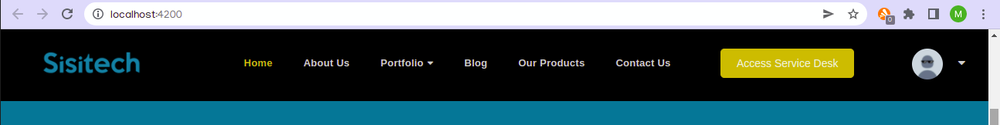

# Sisitech Navigation Bar Library

Sisitech library that handles website navigation bars

## Installation
```
npm i @sisitech/mynavbar --registry=http://npm.request.africa
```

## Usage

Import the library

```typescript
import { MynavbarModule } from '@sisitech/mynavbar'
...

imports: [
    ...
    MynavbarModule
    ...
  ],
```
## About

The library is made up of 5 main components :

| Component Selector | Description | Parameters|
|:------ | :------ |:------ |
|  brand-navbar | Part of the navbar that houses the company logo. The logo is clickable and can redirect to a select url.   | <ol> <li><b>src<b> : path to the image file</li> <li><b>url<b> : link that the one redirects to on clicking the logo</li> <li><b>alt<b> : text that shows if the path provided for src isn't working</li></ol>|
| link-navbar | Where the links to different routes within the website are placed. This section takes multiple arrays as input, each array defining attributes of a single link. | <ol><li><b>type</b> : takes two values (either single or dropdown). Single to mean it's a standalone link and dropdown to mean it's a link with sublinks.</li> <li><b>name</b> : defines the display name of the link</li><li><b>route</b> : takes the name of the route specfied in the routes array in app-routing.module.ts or a https url to the desired page</li><li><b>fragement</b> : this paramater is used if we're defining the route to a section of a page rather than a whole page. For instance, if referring to the portfolio section in the about us page, the route would be defined as <i>about</i> while fragment would be defined as <i>portfolio</i></li> <li><b>subLinks</b> : this parameter takes multiple arrays each with attributes type, name and route. Used for links of type dropdown to define the multiple sub links</li></ol> |
| action-navbar | Defines the different buttons to be displayed on the navbar along with their functions on click. | <ol><li><b>name</b> : defines the display name of the button</li> <li><b>action</b> defines the name of the associated function</li> </ol>  |
| search-navbar | Defines a search form that allows a user to search through the active web page | N/A |
| profile-navbar | Shows the profile summary of the user when logged in and a sign in button when logged out. | <ol> <li><b>src</b> : path to the profile picture of the user</li> <li><b>actions</b> : takes multiple arrays each with attributes name and route</li> <ul> <li><b>name</b> : defines the display name of the button</li> <li><b>route</b> : takes the name of the route specfied in the routes array in app-routing.module.ts or a https url to the desired page</li></ul> </ol> |

## Example

The library can be consumed as a whole with preselected components and in an already defined order as shown :

**app.component.html**

```html

<lib-mynavbar [navBarOptions]="myNav"></lib-mynavbar>

```

The output would be as shown below :

[

The library could also be consumed in bits, choosing a few compoenents and in whichever order the developer desires as shown :

**app.component.html**
```html
    <div>
        <brand-navbar [brandDetails]="myNav.brand" ></brand-navbar>
        <link-navbar [linkDetails]="myNav.links"></link-navbar>
        <action-navbar [actionDetails]="myNav.actions"></action-navbar>
        <search-navbar></search-navbar>
    </div>
```

To achieve the image above, the arrays to be passed t the library are as shown :

**app.component.ts**

```ts

  myBrand: any = [
    {
      src: "https://sisitech.com/images/logo-dark.png",
      url: "http://localhost:4200/",
      alt: "company-logo"
    },
  ]

  myLinks: any = [
    {
      type: "single",
      name: "Home",
      route: "",
    },
    {
      type: "single",
      name: "About Us",
      route: "about"
    },
    {
      type: "dropdown",
      name: "Portfolio",
      subLinks : [
        {
          type: "single",
          name: "Websites",
          route: "portfolio/websites"
        },
        {
          type: "single",
          name: "Mobile Apps",
          route: "portfolio/mobile-apps"
        },
        {
          type: "single",
          name: "IoT",
          route: "portfolio/iot"
        },
      ],
    },
    {
      type: "single",
      name: "Blog",
      route: "null"
    },
    {
      type: "single",
      name: "Our Products",
      route: "null",
      fragment: "products"
    },
    {
      type: "single",
      name: "Contact Us",
      route: "null"
    }
  ]

  myActions: any = [
    {
      name: "Access Service Desk",
      action : this.service()
    }
  ]

  myProfile: any =[
    {
      src: "https://i.pinimg.com/custom_covers/222x/85498161615209203_1636332751.jpg",
      actions : [
        {
          name: "My Profile",
          route: "profile"
        },
        {
          name: "My Collections",
          route: "collections"
        }
      ]
    }
  ]

  myNav={
    brand: this.myBrand,
    links: this.myLinks,
    actions: this.myActions,
    profile: this.myProfile,
  }

```

!!! note
    The functions being passed in the actions array need to be defined in the app.component.ts file.