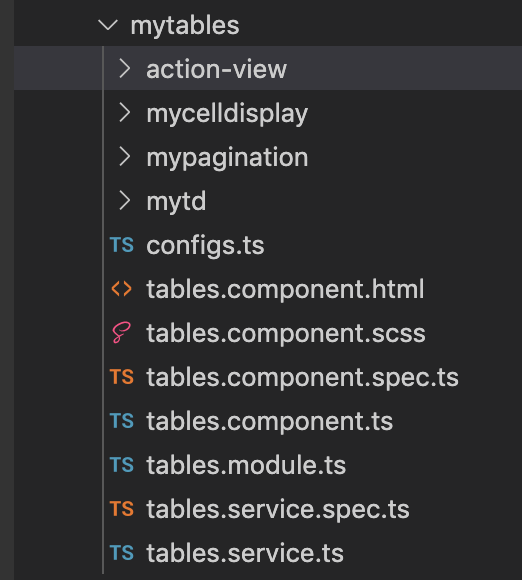
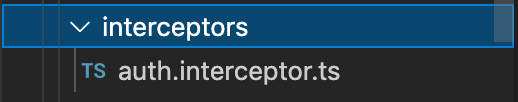
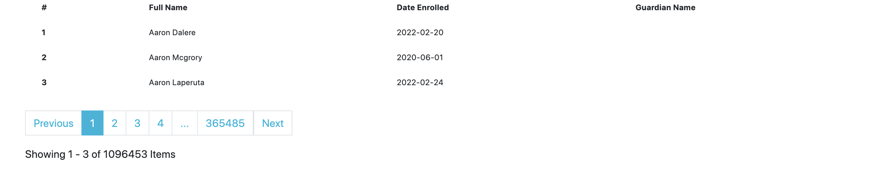

## Sisitech Tables
___

### Introduction

Sisitech Tables allows developers and engineers to structure data such as text, images, links etc into rows and colums. The point of a table is that it is rigid. Information is easily interpreted by making visual associations between row and column headers.

When implemented correctly, HTML tables are handled well by accessibility tools such as screen readers, so a successful HTML table should enhance the experience of sighted and visually impaired users alike.

A basic table includes :-

1. An **action view** which enables inserting of action buttons such as add, edit and delete. 

2. A **cell view** which may contain either header or data information. This is the smallest container inside a table, which is created by a <td> element ('td' stands for 'table data').

3. These tables should use a combination of <td>, <tr> and <th> tags. Table headers <th> are useful to easily find the data you are looking for when the headers clearly stand out. Tables headers also have an added benefit — along with the scope attribute (which we'll learn about in the next article), they allow you to make tables more accessible by associating each header with all the data in the same row or column. Screenreaders are then able to read out a whole row or column of data at once, which is pretty useful.

4. **Pagination** allows our table to take on a lot of data and arrange it into different pages preventing long tables and perfomance issues that arise with visualising alot of data on one table page. 

### Angular Tables 

--- 

#### Installation

- Copy the mytables package into your project's shared folder. 



- Install Bootstrap into your project

The tables use bootrstrap for basic styling. Install the latest boostrap to your Angular project and the additional dependencies. 

``` javascript 
npm i bootstrap@latest --save 
npm i @popperjs/core@2.9.1 --save
npm i @types/bootstrap --save
```

Add these file paths to the style and script array in the ``angular.json`` file

``` json title="angular.json"
"styles": [
     "src/styles.scss"
],
"scripts": [
     "node_modules/@popperjs/core/dist/umd/popper.min.js",
     "node_modules/bootstrap/dist/js/bootstrap.min.js"
]
```

In the style.css overide the desired variables before importing bootstrap. 

``` scss title="style.css"
$primary:#ff5a5f;
$secondary:#484848;
$modal-fade-transform: scale(.8);

@import "~bootstrap/scss/bootstrap";
```

#### Configuration

- Inside your **tables.module.ts**, provide your AuthInterceptor class, update the exports and declarations.

``` ts hl_lines="30 31 32 33 34 37" title="tables.module.ts" linenums="1"
import { NgModule } from '@angular/core';
import { CommonModule } from '@angular/common';
import { FormsModule, ReactiveFormsModule } from '@angular/forms';
// import { NgMultiSelectDropDownModule } from 'ng-multiselect-dropdown';

import { MyTablesComponent } from './tables.component';
import { MytdComponent } from './mytd/mytd.component';
import { MycelldisplayComponent } from './mycelldisplay/mycelldisplay.component';
import { MypaginationComponent } from './mypagination/mypagination.component';
import { ActionViewComponent } from './action-view/action-view.component';
import { HTTP_INTERCEPTORS } from '@angular/common/http';
import { AuthInterceptor } from 'src/app/interceptors/auth.interceptor';


@NgModule({
  declarations: [
    MyTablesComponent,
    MytdComponent,
    MypaginationComponent,
    MycelldisplayComponent,
    ActionViewComponent,
  ],
  imports: [
    CommonModule,
    FormsModule,
    ReactiveFormsModule,
    // NgMultiSelectDropDownModule
  ],
  exports: [
    MyTablesComponent,
    MytdComponent,
    MypaginationComponent,
    MycelldisplayComponent,
    ActionViewComponent
  ],
  providers: [
    { provide: HTTP_INTERCEPTORS, useClass: AuthInterceptor, multi: true }
  ]
})
export class TablesModule { } 

```

Copy paste the ``interceptors`` folder into the app folder and replace the variable API_URL or endpointV1 with your API's URL provided. 



``` javascript title="table.services.ts"
const endpointV1 = 'https://api.safarinjema.wavvy.dev/api/v1/';

```

#### Displaying the Table

Add `<app-mytable></app-mytable>` tag to your **html** page

Refer to the table below for the various basic input and output options. 

| Option | Is Required | Descripiton | Example |
|:------ | :------: |:------ |:------|
| listTypeUrl |  ✅ | Defines the specific URL endpoint you want to fetch your data from | `/api/v1/students` | 
| actionsEvent |  ✅ | `@Output` - Receives a function with the different action items the table can take | `add` , `edit` | 
| headers |  ✅ | Defines the specific column names from the fields available in the API | `full_name`, `date_enrolled` |
| page_size |  ✅ | Number of rows the table displays | `10` |

#### Usage Example

**HTML**

``` html
<my-app-tables [listTypeUrl]="url" (actionsEvent)="handleActions($event)" [headers]="headers" page_size="5">
</my-app-tables>
```

**TS**

``` ts
import { Component, OnInit } from '@angular/core';

@Component({
  selector: 'app-root',
  templateUrl: './app.component.html',
  styleUrls: ['./app.component.scss']
})
export class AppComponent implements OnInit {

  ngOnInit(): void {
    throw new Error('Method not implemented.');
  }

  title = 'myTables';
  url = 'api/v1/students';
  headers = [
    'full_name',
    'date_enrolled',
    'guardian_name'
  ]

  handleActions(event: any) {
    console.log(event)
  }

}

```

#### Testing Your Table

Basic example of a table implementation




### References
[W3 Schools Bootstrap Tables](https://www.w3schools.com/bootstrap/bootstrap_tables.asp)

[Mozilla Developer HTML Table Basics](https://developer.mozilla.org/en-US/docs/Learn/HTML/Tables/Basics)
