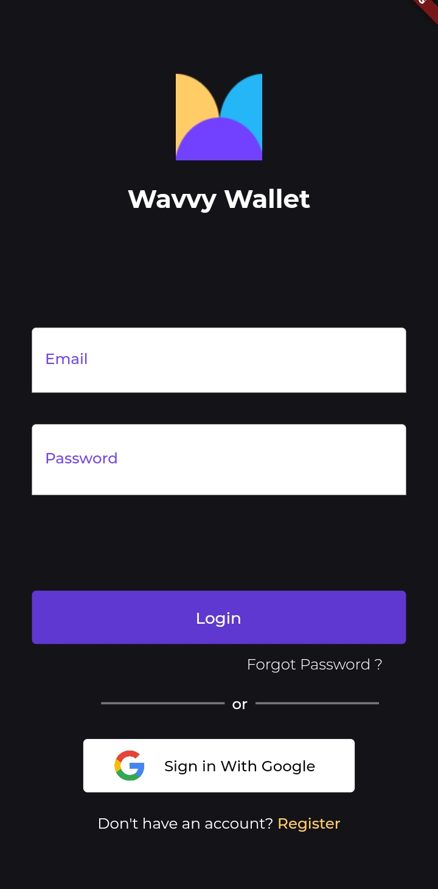
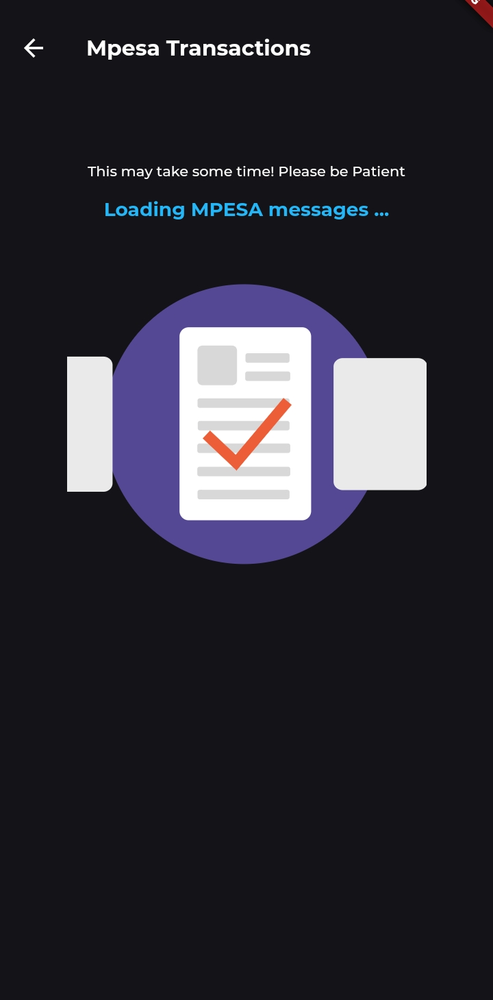
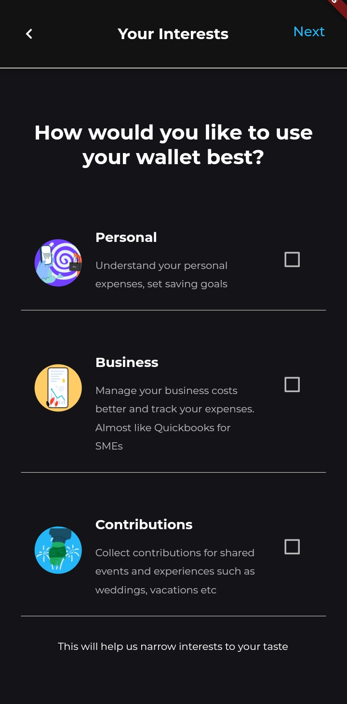
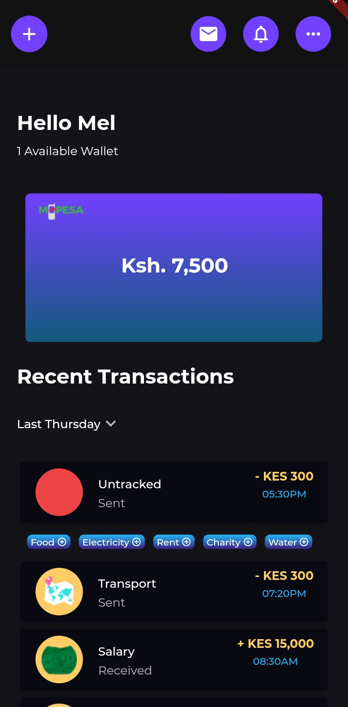

# 5th July 2022 - Wavvy Wallet Brainstorm Meeting Minutes

## References
1. [Wavvy Wallet Designs](https://xd.adobe.com/view/52a9ffa4-429f-4c95-8265-17795676b625-07fa/)
2. [Wavvy Wallet Repo](https://github.com/sisitech/expense_tracker)
3. [Wavvy Wallet API](https://api.expensetracker.wavvy.dev/)
4. [Brainstorm Meeting Recording](https://drive.google.com/file/d/1rVXXbK0EJmRYN99gdrwTEv2b73gq-8Vl/view?usp=sharing)
5. [Brainstrom Document](https://docs.google.com/document/d/1AbL2HI4_eFV1xBRmEAdSYk0xN9zcKS7VYF-sdLfOfB4/edit)

## Initial Sign Up Use Case
- Account Creation should be seperated from the Sign Up process
- The first time Account Creation happens should be when importing mpesa messages after signing up.
- The user flow should be : On board screens ➡️ Sign Up Pages ➡️ Import Messages Page ➡️ Account Creation Page ➡️ Home Page

### Arising Tickets
- 🎟️ : Remove the account creation page from sign up process
- 🎟️ : Rearrange the screens to the user flow above
- 🎟️ : Implement video background for log in screen
- 🎟️ : Disbale going to the next sign up page until data is filled in the previous page
- 🎟️ : Make selecting the image on the gender circle activate the radio button as well - Gender page
- 🎟️ : Show a string of the selected birthday date - DoB Page 

## Import Messages Use Case
- Importing Mpesa messages should allow options on the date range from which mpesa messages should be imported. E.g Last one month, Last three months, Last one year
- Importing messages should be able to happen in the background once allowed regardless of which screen is active or if app is terminated.
- Immediately after allowing the import, the first time user should be taken through Account Creation while importing happens in the background.
- There should be progress indicators showing the importation progress on the Home Page in case user is redirected there before importing is done.
- There should be a default view for a user who doesn't allow importing messages.
- Automatic tagging of messages should happen in the API. The API should then return a list of tagged transactions on the Home Page
- Tagging the associated account for each transaction is left to the user

### Arising Tickets
- 🎟️ : Implement selecting a date range from when mpesa messages should be extracted
- 🎟️ : Direct user to Account Creation soon as they choose an import option
- 🎟️ : Implement importing mpesa messages in the background
- 🎟️ : Implement progress indicators for importing of messages on the Home Page 
- 🎟️ : Implement default Home Page UI for user who hasn't allowed importation of messages
- 🎟️ : Implement tagging of transactions in the API
- 🎟️ : Implement showing the tag details for each transaction from the API to the Home Page UI
- 🎟️ : Implement UI that prompts user to tag the account associated with the transactions on the home page

## Account Creation Use Case
- A wallet is an entity relating to a specific type of transactions e.g. Mpesa Wallet (mpesa transactions), Equity Wallet(equity transactions), MasterCard Wallet e.t.c. 
- An account on the other hand, is a variation of a single wallet, basically different intereprtataions/classifications of that wallet's transactions. For example, Mpesa Wallet can have 3 accounts : Personal Account, Business Account and Contributions Account.
- The Contributions name should be renamed to Chama account as it's more descriptive
- Account Creation should entail :
  1. Choosing the type of account (one account at a time)
  2. Filling a form with details of the account to be created
  3. Tagging assocated transactions with that account

### Types of Wavvy Wallet Accounts

Features that cut across all types of accounts : 

- [x] Import Transactions
- [x] Tag & Categorize Transactions : User can create categories and tags or can use the preset one in the app. Tagging can be done manually or automatically by the API.
- [x] Tag Account : User manually assigns a transaction to any one of their created accounts.
- [x] Copy Paste Transactions : For mpesa messages that aren't received via MPESA texts as well as those who haven't allowed message importation.
- [x] Spending Limits : Allows one to put a limit on the amount they can spend on certain tags and categories. The app notifies them when they are about to reach this limit so that they can regulate their spending.
- [x] Loan Tracking i.e. Tala, M Shwari, Fuliza etc : Allows a user to add a loan entry for a certain paybill/phone number or till number. The app then tracks the related transactions and shows the user their loan payment progress.
- [x] Manual Wallets i.e. cash, bank transactions
- [x] Expense Reminders : A user can set a reminder for recurrent expendiures and can get reminders for when these expenses are due. Once a related transaction is made, the app marks the reminder as done and notifies the user.
- [x] Expense Analytics : The app provides a comprehensive breakdown of expenses made over time as well necessary deductions of it. 

| Personal Account | Dependant Account |
| :------ |:------ |
| A personal account is a one person account that shows only personal transactions and the associated tags.    **Personal Account Features** <ol><li>Invite Depender : One can create another personal account for a dependant. The creator of the account can only view the dependant's transactions and spending habits but cannot edit them.</li></ol> | A dependant account is a special type of personal account that allows one to invite another person to view their transactions over time. It can be thought of as a Jumbo Junior Account for a child, where the parent is involved in the child's transactions. This type of account is suitable for arrangements such as : <ul><li>Parent - Child Wallet</li><li>Gurdian - Elderly Wallet</li></ul>   **Dependant Account Features** <ol><li>Invite Dependee : The owner of the dependant account can invite another person (ideally the one they depend on) to their perosnal wallet.</li></ol> |
 

| Business Account | Chama Account |
|:------ | :------ |
|  A business account is a multi person account that shows business/company related transactions and the associated tags. A business account can be used : <ul><li>To keep track of petty cash used by employees</li><li>As a point of reconciliation</li><li>As a verfication for reinbursment of personal funds used for business affairs</li></ul>   **Business Account Features** <ol><li>Add Paybill or Till Number</li><li>Add Business Name</li><li>Invite Business associates : The different types of associates that can be added include : <ul><li>Owner (super admin) : Creates the Business Account. Can add other people. Can appoint other owners. Can appoint wallet CFOs. Can view all the business transactions. Can edit all business transactions. Can view all business analytics</li><li>CFO (basic admin) : Can add other people. Can view all the business transactions. Can edit all business transactions. Can view all business analytics</li><li>Member : Can view only their business transactions</li></ul> </li></ol> | A chama account is a multi person account that shows group related transactions and the associated tags. A group can be a group of friends, a person and their spouse, a family e.t.c, basically any group setting that would like to co-ordinate their transactions together for various reasons e.g. to save, to spend better e.t.c.    **Chama Account Features** <ol><li>Add Paybill or Till Number</li><li>Add Chama Name</li> <li>Invite Chama associates : <ul><li>Owner (super admin) : Creates the Chama Account. Can add other people. Can appoint other owners. Can appoint wallet treasurers. Can view all the chama transactions. Can edit all chama transactions. Can view all chama analytics</li><li>Treasurer (basic admin) : Can add other people. Can view all the chama transactions. Can edit all chama transactions. Can view all chama analytics</li><li>Member : Can view only their chama transactions</li></ul></li></ol> |

### Beta Features

1. ⏳ Tag Saving Goal - We would need to introduce saving with Wavvy Wallet or a 3rd party bank/sacco etc.
2. ⏳ Getting legal verifictation for businesses using business accounts on Wavvy Wallet

### Arising Tickets
- 🎟️ : Change the page title to Account Set Up and the 'Contributions' Account Name to 'Chama'
- 🎟️ : Implement all the general features that cut across all accounts
- 🎟️ : Create forms that take account creation details for each type of account
- 🎟️ : Implement Personal Account features as listed above
- 🎟️ : Implement Dependent Account features as listed above
- 🎟️ : Implement Business Account features as listed above
- 🎟️ : Implement Chama Account features as listed above
- 🎟️ : Implement specialised expense analytics for each type of account

## Home Use Case
- The default home page should be as is in the design i.e the wallet balance at the top and the list of all the transactions at the bottom.
- The list of transactions should contain all wallet transactions made across all accounts with the necessary tag details (account, amount, date, category, tag) visible from each item on the list.
- The Home page should have an add button from where a user can either add a Transaction, Account or Wallet.
- The Home page should have a button that enables one to switch between accounts
- The Home Page should support different views for each account i.e show different functinality and a filtered list of transactions for each account.

### Arising Tickets
- 🎟️ : Implement the default home page with all the transactions
- 🎟️ : Implement showing account tag for each transaction in the list view on the home page 
- 🎟️ : Implement showing filtered transactions as well as buttons (functionality) for a specfic account when accounts are switched.
- 🎟️ : Implement adding a Transaction, Account or Wallet user flow

## AoB

1. The next meeting was scheduled for next week Tuesday (12/07/2022) at 10am
2. It was agreed that meanwhile necessary documentation and designs would be made following the discussions in this meeting
3. Developing would also continue for features that don't need redesigning