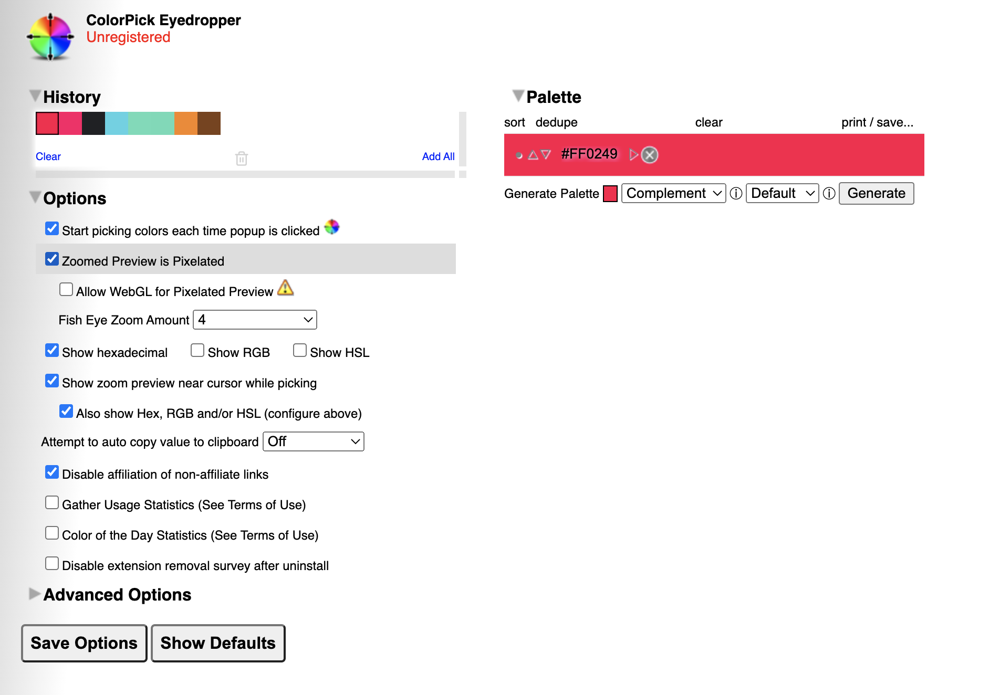
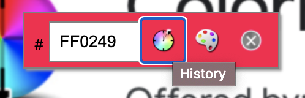
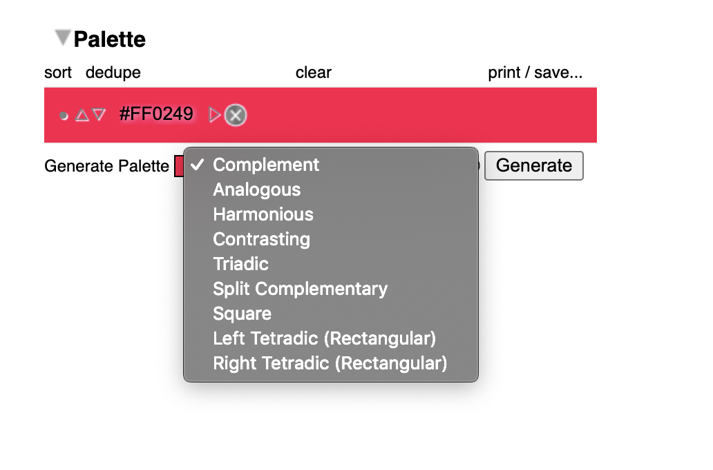
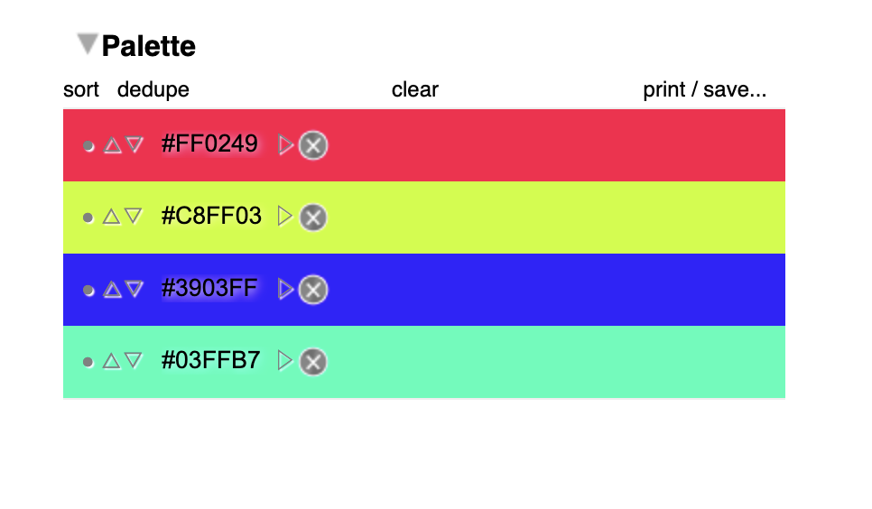
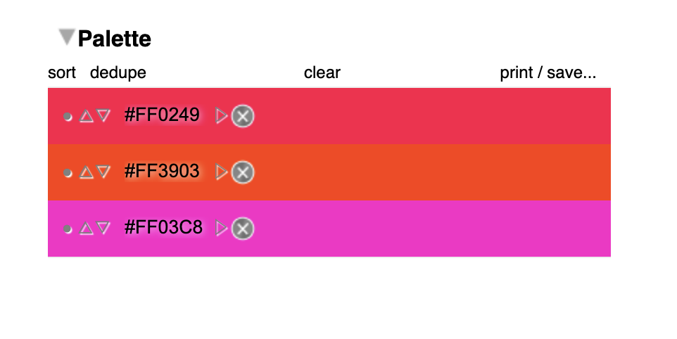

## Color Pick Eye Dropper

The color pick eye dropper is a web extension that allows you to select color values from webpages and more. 

### Installation

Instal the color picker extension from the Chrome Web Store. 

[Chrome Web Picker Install](https://chrome.google.com/webstore/detail/colorpick-eyedropper/ohcpnigalekghcmgcdcenkpelffpdolg?utm_source=chrome-ntp-icon)

### Features

Apart from the basic feature of picking a color from a web page, an interesting feature I stumbled upon is the ability to automatically generate different color palettes by a click of a button. 

#### Color Palettes

A color palette, in the digital world, refers to the full range of colors that can be displayed on a device screen or other interface, or in some cases, a collection of colors and tools for use in paint and illustration programs. The color palette reveals a lot about the electronic design of the device or technology, and its visual capabilities for human users.

A color palette is also known simply as a palette.The proper usage of color palettes means evoking a particular emotion, vibe, or aesthetic.

#### The Meaning of Color

Along with varying visual impact, different colors also carry different emotional symbolism.

- Red — typically associated with power, passion, or energy, and can help encourage action on your site

- Orange — joy and enthusiasm, making it a good choice for positive messaging

- Yellow — happiness and intellect, but be wary of overuse

- Green — often connected to growth or ambition, green can help give the sense that your brand is on the rise

- Blue — tranquility and confidence, depending on the shade — lighter shades provide a sense of peace, darker colors are more confident

- Purple — luxury or creativity, especially when used deliberately and sparingly on your site

- Black — power and mystery, and using this color can help create necessary negative space

- White — safety and innocence, making it a great choice to help streamline your site

___

After picking a color from a web page, head to the palettes section by clicking on the **history** or **generate palette** button 

Under generate palette, you can create complementing, analogous, harmonious, contrasting etc palettes depending on your color combinations of choice and need. 

#### Color Schemes

 | Color Scheme | Description | Usage | 
 |:------|:------| :------ |
 | Monochromatic / Complement | Monochromatic color schemes use a single color with varying shades and tints to produce a consistent look and feel. Although it lacks color contrast, it often ends up looking very clean and polished | Charts and Graphs |
 | Analogous | Analogous structures do not create themes with high contrasting colors, so they're typically used to create a softer, less contrasting design | Great for creating warmer (red, oranges, and yellows) or cooler (purples, blues, and greens) color palettes |
  | Complementary | The complementary color scheme provides the greatest amount of color contrast.  | It's best to use one color predominantly and use the second color as accents in your design |
  | Split Complementary | A split complementary scheme includes one dominant color and the two colors directly adjacent to the dominant color's complement. This creates a more nuanced color palette than a complementary color scheme while still retaining the benefits of contrasting colors. | |
  | Triadic | Triadic color schemes offer high contrasting color schemes while retaining the same tone. | Looks great in graphics like bar or pie charts because it offers the contrast you need to create comparisons. |
  | Square | Square color schemes are great for creating interest across your web designs | |
  | Rectangle | The rectangle approach is similar to its square counterpart but offers a more subtle approach to color selection.  | |

#### Example Using the Color Picker

**Square**

**Analogous**

#### Notes

- No matter which color scheme you choose, keep in mind what your graphic needs. If you need to create contrast, then choose a color scheme that gives you that. On the other hand, if you just need to find the best "versions" of certain colors, then play around with the monochromatic color scheme to find the perfect shades and tints.

- Remember, if you build a color scheme with five colors, that doesn't mean you have to use all five. Sometimes just choosing two colors from a color scheme looks much better than cramming all five colors together in one graphic.

### References

[Color Palette](https://www.techopedia.com/definition/6547/color-palette)

[Color Theory](https://blog.hubspot.com/marketing/color-theory-design)