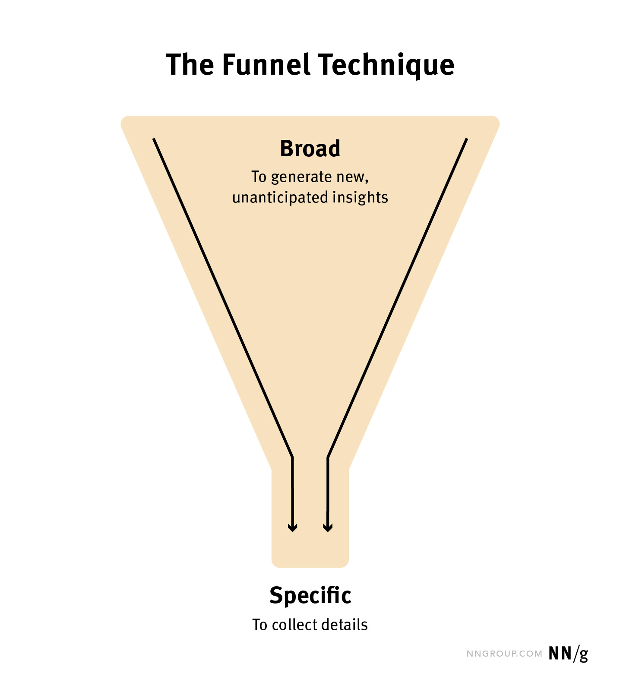
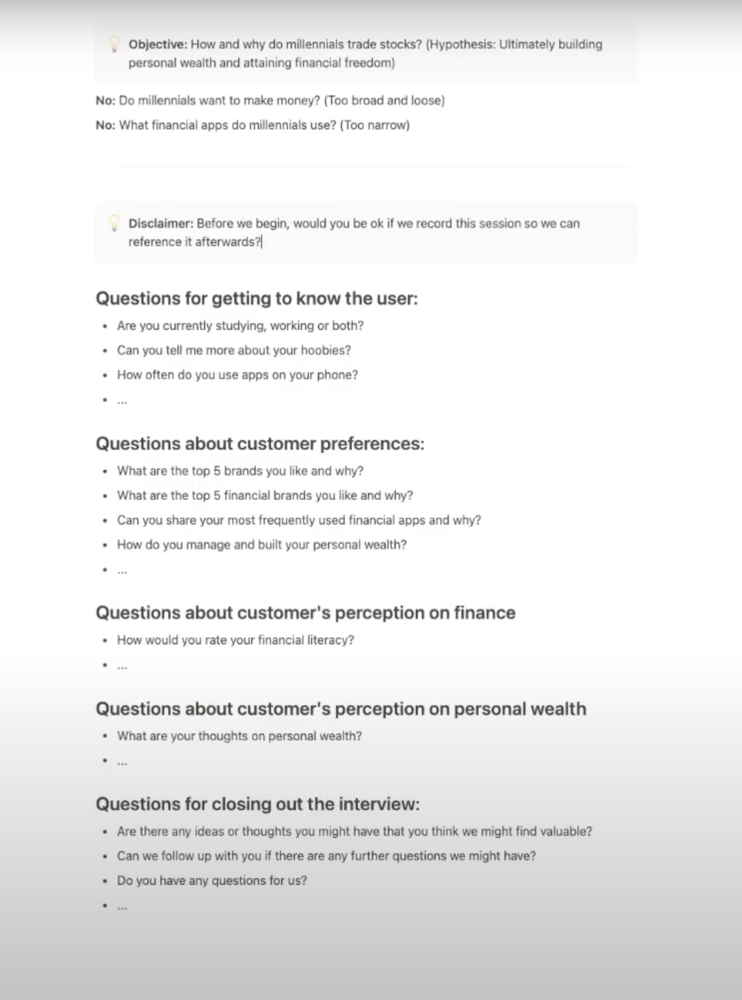

# How to Conduct Effective User Interviews

## Overview

- User interviews are essential UX research methods.
- Sessions involve 1-on-1 question-answer formats.
- A clear goal and plan are paramount.
- The purpose is to collect qualitative, self-reported data.
- Focus is on users' words over their actions.
- Listen actively for problems or pain points related to research objectives.
- They assist in defining personas and determining features.

## Preparing for the Interview

### Set Clear Goals

- Determine specific objectives to keep the interview focused.
  - Example: Understand millennials' attitude towards expense tracking and saving.

### Recruitment and Planning

- Recruit participants.
- Organize logistics to ensure participants are in a relaxed and neutral setting.
- Recording is recommended but:
  - Always ask for permission to record.
  - Hand-written notes might make the interviewee uncomfortable.
- Prepare questions in advance.

### The Funnel Interview Technique

- Start with broad topics and narrow down.

- Avoid bias and capture all essential data.

- Use 5-8 open-ended questions followed by follow-up queries.
- Begin with general questions and probe for details.
  
### Interview Etiquette

- Begin with a human connection; avoid being transactional.
- Offer a warm opening statement.
  - Example: "Hi, I'm Ali... Do you have any questions before we begin?"
- Provide context for your questions.
- Ensure participants feel acknowledged and valued.
- Avoid technical jargon.
- Conclude by allowing them to ask any questions (the doorknob effect).
- Establish rapport; inquire about their background gently.
- Speak less, listen more.

### Crafting Objectives

- Clearly define objectives for actionable insights.
  - Example: How and why do millennials trade stocks? (Potential answer: Building personal wealth).
- Avoid overly broad or narrow questions.
- Remember: Objectives -> Business Questions -> Research Questions.

### During the Interview

- Be adaptable with the questions and their sequence.
- Limit interviews to one hour.
- Practice with team members through role-playing before actual interviews.
- Embrace a humble attitude, aiming to learn from the participant.
- Video calls are often preferred for remote interviews.

## References 

- [The Funnel Technique in Qualitative User Research](https://www.nngroup.com/articles/the-funnel-technique-in-qualitative-user-research/#:~:text=The%20funnel%20is%20a%20fitting,perceptions%20as%20much%20as%20possible.)
- [How To Conduct User Interviews Like A Pro (UX Design)](https://youtu.be/5tVbFfGDQCk)
- [User Interviews 101: A Practical Guide to UX Research Interviews](https://youtu.be/rTNUTeXNG-c)
- [How to Conduct a User Interview for UX Designers (in 10 Minutes) - FREE Template Provided](https://youtu.be/KZ6jj_EZUgM)
- [How To Conduct User Interviews (UX Design)](https://youtu.be/Q_m1-3mCyiI)
- [Using the Funnel Technique in User Interviews](https://youtu.be/2wF9tWSugm4)

