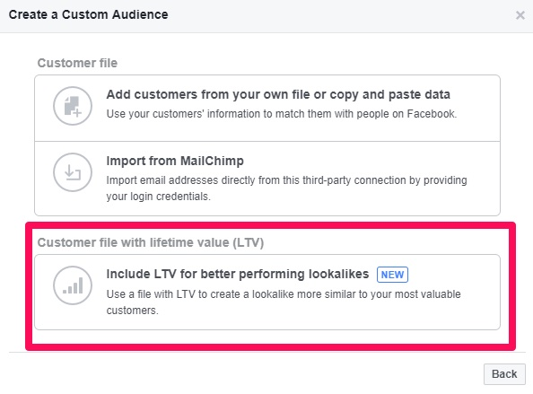

# Wavvy Wallet Business Case 

## Proposition - Tamaduni Gardens, Kilifi
- 🎟️ : The business premise has a separate phone for all its MPESA transactions / sales that are auto-forwarded to the bank every morning (all the total amount is forwarded).
- 🎟️ : Everyday starts off a fresh new day for MPESA transactions. 
- 🎟️ : This presented a business case to use the customers information for customer ranking (understanding customer loyalty. 
- 🎟️ : This presented a business case for marketing (targetted bulk SMS) and digital marketing strategies using customer data. 
- 🎟️ : One of the most potential usage of the product will be addition of POS functionality i.e. book-keeping and generation of profit and loss statements. 

## Automarketing Marketing Insights

- In marketing, the customer lifetime value is the total worth to a business of the customer over the whole period of their relationship. Top companies such as 
Meta have implemented and allowed advertisers to incorporate customer lifetime value in their marketing campaigns. 

- According to Meta, customer lifetime value is a numeric representation of the net profit you predict will be attributable to a given customer over the duration of your relationship with them. You can break it down into a few factors:

            - 🎟️ :How often a customer makes a purchase within a typical purchase cycle
            - 🎟️ :How much a customer spends each time they make a purchase
            - 🎟️ :The potential length of a customer's relationship with you

- For Wavvy Wallet, we can provide our customers with intelligent insights by automatically calculating the lifetime value of each of their clients. We can do this by using a simple formula basing on the MPESA sms message history.

           - 🎟️ :Number of MPESA messages from same number
           - 🎟️ :Total amount received from same number
           - 🎟️ :Date of latest transaction
           - 🎟️ :Date of first imported transaction
           - 🎟️ :Lifetime = (Date of first imported transaction - Date of latest transaction) in days
           - 🎟️ :CLV = (Lifetime x Amount Spent) / X

- Example of customer report with CLV. 

| Customer Name | Phone Number | Number of transactions | Number of unique visits |Total amount spent | Day of First Transaction | Day of Week of First Transaction | Month of First Transaction |  Year of First Transaction |  Time |  Lifetime Value 
|:------ |:------ | :------ |:------ |:------ | :------ |:------ |:------ | :------ |:------ |:------ |
| Ali Chivatsi Dennis | 0715415865 | 8 | 4 |3000 | 28 | Saturday | July | 2022 | 06:40PM | 4.6

      
## Competitor Matrix

- 🎟️ : [View Competitor Matrix Document](https://docs.google.com/spreadsheets/d/1GhEhEKRHmN0AVjjjTvewABs_8fqzlgOhV6xOIkynOAA/edit?usp=sharing)

## References

- 🎟️ : [How to Calculate Customer Lifetime Value](https://www.youtube.com/watch?v=eHi875QuVcA&ab_channel=EricAndrews)

