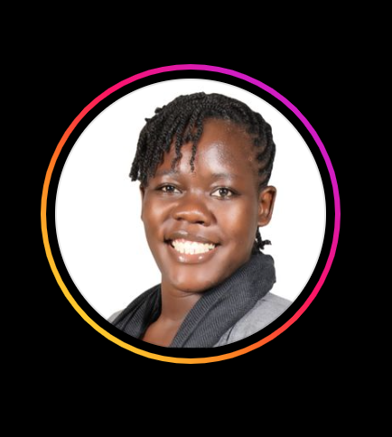

# Wavvy Wallet Market Research

- An extension of Ali's breakdown on how to approach market research using interviews.[Ali's Article](../Ali/Conducting%20User%20Interviews.md)

## Target Groups
- The image below shows the different target groups we're targeting and the best way to approach market research for them.
   
 
  

## Research Flow
- The image below shows a suggested flow chart of the market research we aim to conduct.
- The key here is to note the iterative nature of research. The goal is to not only find out what the pain points are but to also create a connection with our interviewees in such a manner that they will always be available to provide feedback during the prototyping and building phase. 
   
 
  

- As per the previous meetings, we established that the best way to isolate the right interviewees is from general surveys we can run through **financial literacy** influencers. The following table highlights our pool of choice in this regard:

 

| Influencer                                     | IG Handle                                                       | Influencer Highlights                                                                                               | Rate Card | Contact | Status |
| ---------------------------------------------------- | --------------------------------------------------------------- | ------------------------------------------------------------------------------------------------------------------- | --------- |--------- |--------- |
|  | [just_ivy_africa_](https://www.instagram.com/just_ivy_africa_/) | <ul><li>Biggest Finance Litercay Brand In Kenya</li><li>WIde audience - featuring mostly millenials and Gen Z.</li> | ? / story | business@justivyafrica.com ||
|       | [susan.wanjiku](https://www.instagram.com/susan.wanjiku_/)      | Featured by business daily as O.G finance coach                                                                     | ? / story |info@thelegacyhub.co.ke / 0707 446 769||
|        | [djlapoze](https://www.instagram.com/djlapoze/)                 | <ul><li>Male Audience</li></ul>                                                                                     | ? / story ||
|  | [julietodhiambo](https://www.instagram.com/julietodhiambo)      | <ul><li>An expert in the domain, may offer insights herself</li><li>General finance literacy channel</li></ul>      | ? / story | pesasavvy@gmail.com / 0719 731 828| Positive Response (Setting up virtual meeting) |
|  | [money_clinicke](https://www.instagram.com/money_clinicke/)     | <ul><li>General finance literacy channel</li></ul>                                                                  | ? / story |+254750048153| |
|  | [moneyafrica](https://www.instagram.com/moneyafrica/)           | <ul><li>General finance literacy channel</li></ul>                                                                  | ? / story |info@themoneyafrica.com| |
|  | [Claire Nansikombi](https://www.instagram.com/be.your.own.boss.babe/)           | <ul><li>Business Coach</li></ul>                                                                  | ? / story |claire@beyourownbossbabe.com||
|  | [Wanjiku The Startup Consultant](https://www.instagram.com/wanjikustartupconsultant)           | <ul><li>Startup Consultant</li></ul>                                                                  | ? / story |0711194414||
|  | [Clarence Muhoro](https://www.instagram.com/clarence_muhoro/)           | <ul><li>Investment Coach</li></ul>                                                                  | ? / story | |Positive Response (Setting up virtual meeting) |
|  | [Trish Maina](https://www.instagram.com/trish_maina/)           | <ul><li>Beauty, Fashion and Lifestyle Creator</li></ul>                                                                  | ? / story |partnerships.trishmaina@gmail.com||

 

## The Questionnaire

[Expense Tracking Survey](https://forms.gle/6u8J6hiZHCCWFuP68)

## Influencer Brief
[Expense Tracking Survey Brief](https://docs.google.com/document/d/1Hl9xoFxuiUTl8XZYoQmeorm9cyfVH9kHvmYKqTwC6R8/edit?usp=sharing)

## Influencer Cold Email Template
[Influencer Cold Email Template](https://docs.google.com/document/d/1mvse3PSCA9HB0xCmU0jQxvVOUeiQF8g-PF7-6tLfoiU/edit?usp=sharing)

