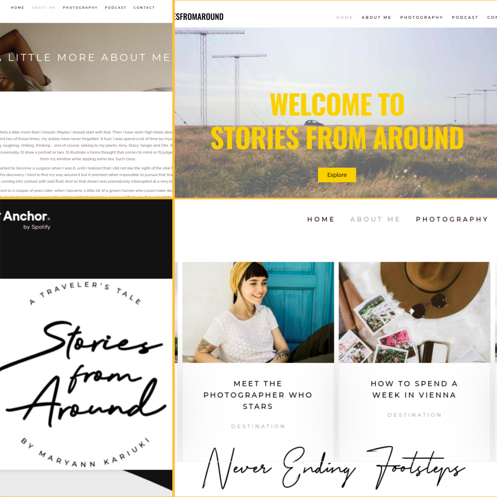
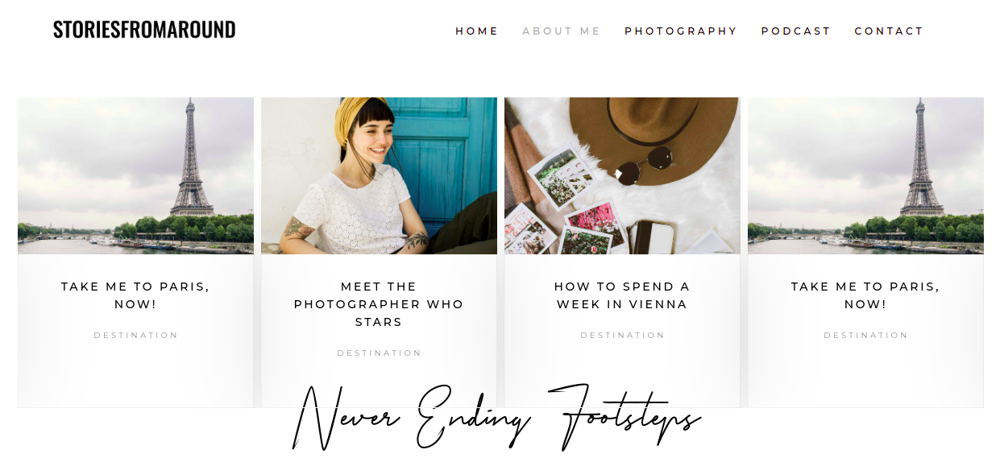
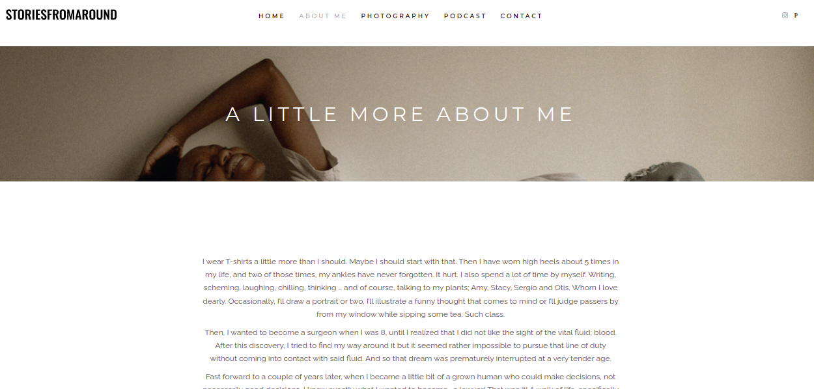
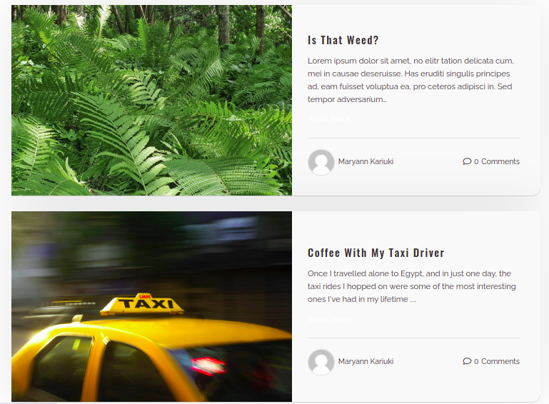
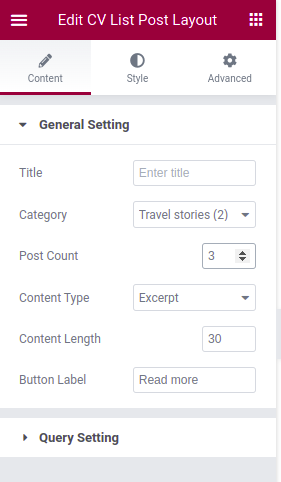

# Stories From Around Project

[Stories from Around](https://storiesfromaround.com/) is a travel blog website that showcases different tales of different encounters with people, cultures, experiences among other escapades of the reknown travel blogger Maryann Kariuki. 

**Development Tools** : Wordpress, Elementor  
**Development Period** : 29/09/2021 - 27/05/2022  
**Client** : Maryann Kariuku  
**Project Status** : Completed

## Project Layout

### **The FrontEnd**

The website content is divided into 6 key pages :

1. [Home](https://storiesfromaround.com/) : This is the main landing page of the website. It's made up of a main header that welcomes readers to explore Stories From Around. Right below the welcome section is a brief teaser of some of the sample blogs. Finally, there's a subscribe form where readers can sign up to get any updates and additional information from Stories From Around.

2. [Blogs](https://storiesfromaround.com/blogs/) : This page contains a carousel of blogs from a select category. It's accessed by pressing the 'Explore' button on the Home page welcome section.

3. [About Me](https://storiesfromaround.com/about/) : The About Me page contains an intriguing piece delving deeper into who Maryann is. It serves as a warm invite to readers into the life of the persona behind the articles on Stories From Around.

4. [Photography](https://www.pexels.com/@maryannkariuki/) : Links out to Maryann's Pexels Profile that showcases her photography works.

5. [Podcasts](https://anchor.fm/maryann-kariuki0) : Links out to Maryann's Podcast on Spotify.

6. [Contact](https://storiesfromaround.com/get-in-touch/) : Contains a brief form that allows readers to get in touch with Maryann.

### **The BackEnd**

The backend of the project is accessed by signing into the Stories From Around wordpress account using this [link](https://storiesfromaround.com/wp-admin/) with the appropriate credentials. After succesfully signing in, the panel below appears above the navigation bar.

On clicking Dashboard, the control panel where edits to the site can be made opens up.

## Useful Guides

### **How to Upload a Blog**

1. From the panel, click **+ New**. It displays a drop down menu with several new elements that you can create. To create a new blog post, click on **Post**

2. It then displays the Wordpress Editor where you can add a title, text, images, links among many other things to your new blog post. 

### **How to Define Blog Specifications**

1. On the top right side of the panel, click on the settings icon to open up a side panel fom which one can add extra specifications to a blog post.
2. The side panel shows different settings one can customise for the new blog post as shown in the image above. 
3. For example, to categorise the blog so that it shows when filtered by a spoecific filter, one clicks the Categories button on the side panel. A drop down appears with the different categories the blog can be tagged by.

4. One can also add a new category by clicking the **Add New Category** button.
5. Once editing is done, one can either preview the blog post or publish it for viewing from the top right corner of the editing panel.

### **How to Filter Blogs in View**

In the Home Page, only a select number of blogs from a select category can be seen. To change these settings follow the following steps :

1. In the Home Page on the editing panel on top of the navigation bar, click on **Edit with Elementor**.

2. Once clicked, the elementor ediing panel for the Home Page opens up. Scroll down to the Home Blogs List section and click on to show the **Edit CV Post Layout** panel

3. To change the category, click on **Category**. It shows a dropdown menu of the various categories available. Click on a catgeory to change the blogs in view in the Home Page.

4. To change the number of blogs being shown, change the number on the **Post Count** setting.
5. Once done, remember to press the update button on the bottom left side of the editing panel. Once it turns back to grey from green, the changes will be published to the main site.

## Design Specification

### **Product Design**

**Information Design Structure** : Content in Stories From Around is designed using the **Catalog Structure**. This means that content is organised into and displayed by differnet categories. Such a structure allows users to browse a category of interest and view the details of a specific blog item.

**Design Aesthetic** : The design aesthetic for Stories From Around is **Minimalistic**. It's user interface uses subtle design components that provide a straight forward and effortless display of content which gives the user an experience where blogs and actions take the forefront of the user experience.

### **Colour**

Stories From Around makes use of a minimalistic pallet with one main bright colour for highlights, a dark colour for contrast and a single colour for background and surface colour.

| Colour | Description |
|:------ | :------ |
| 
 
Yellow : #FFC03A
 
 | The main colour used for headings, to highlight sections and also links. |
| 
 
Black : #000000
 
 | The color used for descriptions and text for contrats from the otheriwse bright background and surface colour. |
| 
 
White : #FFFFFF
 
 | The background and surface colour. |

### **Typography**

Stories From Around makes use of various fonts to come up with the aesthetic type scale necessary for the website's content. The main font used is the [Raleway](https://fonts.google.com/specimen/Raleway?query=raleway) typeface. This font is used for blog descriptions,excerpts and small headings.

For headings, the [Oswald](https://fonts.google.com/specimen/Oswald?query=oswa) typeface is used.

An accent typeface by the name Primera Signature is also used in Stories From Around to accentuate major details such as the blog owner's name or the country from which a blog story originates.

The logo makes use of both the Oswald and Primera Signature fonts.