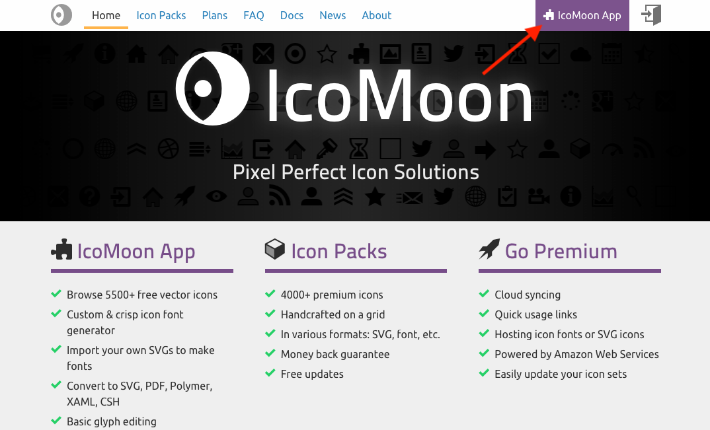
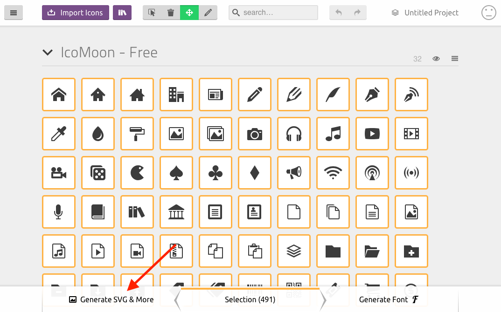
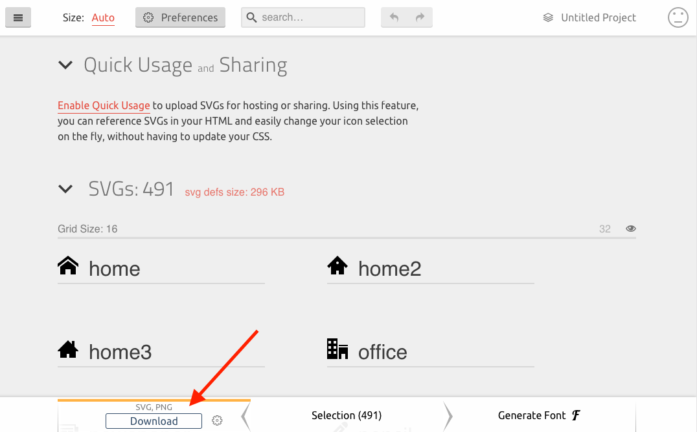
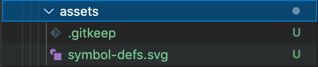

## Sisitech SVG Sprite Icon System
___

Sisitech SVG is an Angular SVG Sprite Icon system that assists a developer to quickly and easily integrate svg sprite icons into your angular project. Similar to HTML, SVG elements hava a DOM element and therefore can be manipluated with classes and styled accordingly. 

### Benefits of an SVG Sprite Icon System

1. SVGs don’t experience the problem of anti-aliasing like fonts do, so your icon will always be crisp. 
1. You can manipulate different elements within an SVG. 
1. Multi-colour support
1. More & easier control over the positioning of an icon (fonts are under the influence of vertical-align, line-height, letter-spacing, word-spacing)

### Installation

- Install the `@sisitech/angularsvg` component from the library into your project [here](http://npm.request.africa/-/web/detail/@sisitech/angularsvg).

- Import `AngularsvgModule` modules into your project. 

``` ts hl_lines="6 15" title="app.module.ts" linenums="1"

import { NgModule } from '@angular/core';
import { BrowserModule } from '@angular/platform-browser';

import { AppRoutingModule } from './app-routing.module';
import { AppComponent } from './app.component';
import { AngularsvgModule } from '@sisitech/angularsvg';

@NgModule({
  declarations: [
    AppComponent
  ],
  imports: [
    BrowserModule,
    AppRoutingModule,
    AngularsvgModule
  ],
  providers: [],
  bootstrap: [AppComponent]
})
export class AppModule { }


```


### Usage

!!! note
        We chose `icomoon` for our icon set since it easily allows usage of more than 5000 free vector icons and custom icon importation. 

- Go to `icomoon’s` [website](https://icomoon.io/) and click on the purple button “IcoMoon App”.



- Choose the icons you want to add and click on “Generate SVG & More”.



- Now we can download the generated SVG icon set.



- When the download is successful, we unzip the file. There is a file called symbol-defs.svg. This is the SVG sprite we’re going to use. So copy & paste this file inside  your `src/assets` folder of the Angular app.



- Your SVG icons should be ready to use, add one in your html file like below. 

``` html
<svg-icon icon="facebook" class="icon"></svg-icon>
```

!!! note
        We use the `icon` input decorator to pass the name of our icons added i.e. `facebook`. You can also style the icon directly inside your components scss file. We want to apply styling on the component tag and be done with it. Other components who consume this component should’t need to know the internal implementation.

``` css 

svg-icon {
    fill: red;
}

```


### References
[Using an SVG sprite icon system in Angular](https://medium.com/@rubenvermeulen/using-an-svg-sprite-icon-system-in-angular-9d4056357b60)


