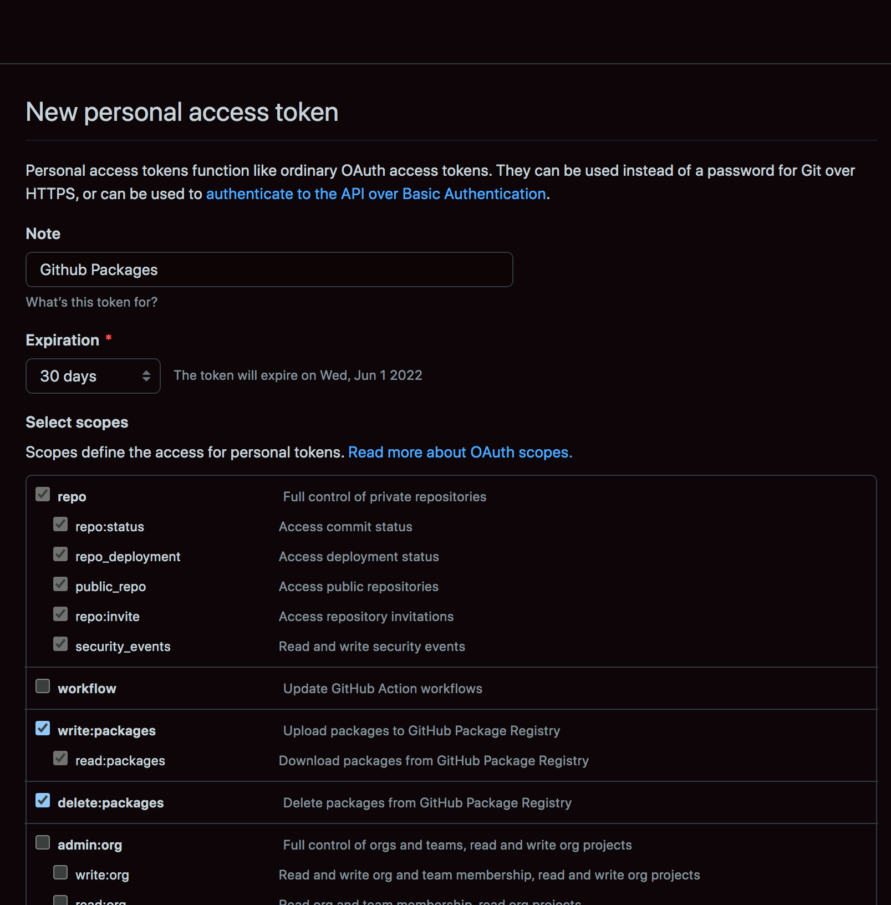

# Switch to Github NPM Package Registry

## Remove the old NPM registry

Remove the previously configured [npm.request.africa](http://npm.request.africa)

```bash
 npm config delete registry 
```

Remove all the references to `--registry=npm.request.africa` from any documentation

## Configure Github Package Registry

### 1. Create a Personal Github Access Token

- Access the Developer Settings from your Github's profile page. Here is the link [Github Developer Settings](https://github.com/settings/apps)
- Create a personal access token with the `Repo` and `Packages` read and write scopes.


- Copy the access token.

### 2. Authenticate your local NPM into Github Packages Registry

Configure your `.npmrc` file  to use the Github Package registry for your private repositories.
The file is located in your `$HOME` directory

```bash title="~/.npmrc"

registry=https://registry.npmjs.org/
@sisitech:registry=https://npm.pkg.github.com/
//npm.pkg.github.com/:_authToken=your_token

```

### 3. Update the package.json file

``` title="projects/svg/package.json"
"publishConfig": {
    "registry":"https://npm.pkg.github.com/"
}
"repository":"git://github.com/sisitech/sisitech-svg"
```

!!! caution
    For the repository follow the above format. Copy the link from the browser and replace the `https` with `git`

!!! caution
    You should update the package.json for the `lib` not the `workspace`.

### Done

```
npm run svg:publish
```

### References

- [Hosting private NPM packages for free](https://andreybleme.com/2020-05-31/hosting-private-npm-packages-for-free/)
